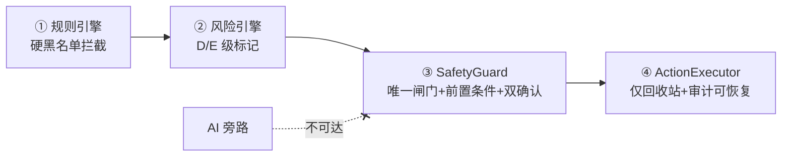
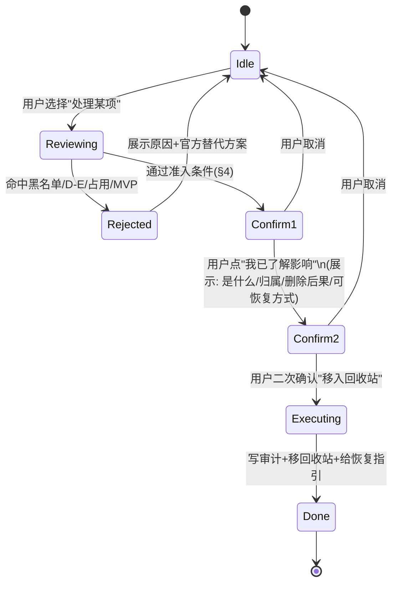
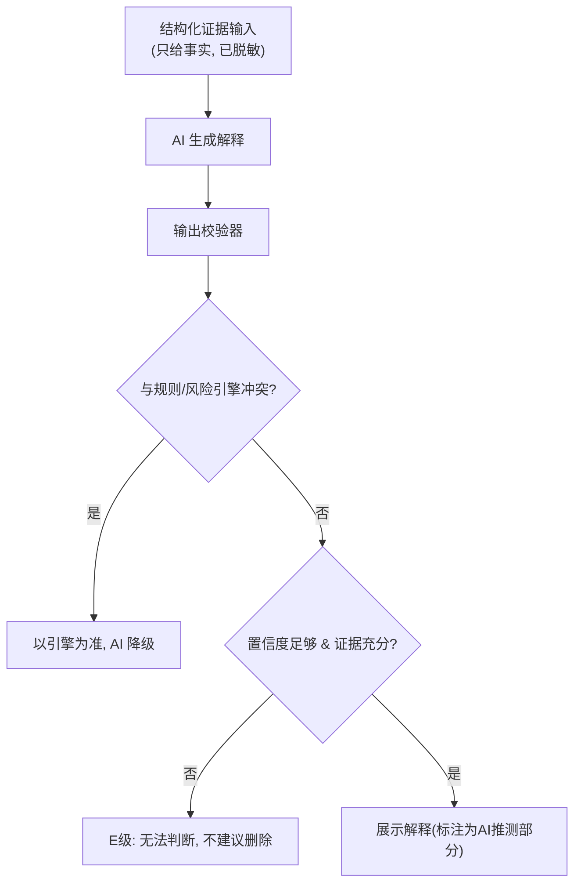

# CleanScope 安全设计（SEC v1.0）

> 上游依据：[需求冻结文档.md](需求冻结文档.md)（SR-1～10 / PR-1～7 / MVP 零删除）、[架构设计.md](架构设计.md)（SafetyGuard 单一闸门 / 规则引擎权威 / AI 旁路 / 四信任域）、[技术选型决策.md](技术选型决策.md)（C#/.NET8/WPF）。
> 配套文档：[风险分级细则.md](风险分级细则.md)（A–E 五级可执行判定表）。
> 阶段：④ 安全模型　｜　状态：设计稿，待评审　｜　不含实现代码。
>
> **本设计第一性原则：CleanScope 是"解释器"，不是"删除器"。第一版默认不删任何文件；删除能力在结构上未接通（SafetyGuard 全拒）。安全机制的目标不是"安全地删"，而是"在结构上让误删不可能发生"。**

---

## 0. 安全设计总纲（四道防线）

误删防护采用**纵深防御**，任意一道失守仍有下一道兜底：



| 防线 | 作用 | 对应红线 |
|---|---|---|
| ① 规则引擎 | 已知危险目录/类型，硬规则直接拦截 | SR-6/8 |
| ② 风险引擎 | 综合证据定级，D/E 级不可删 | SR-2/5 |
| ③ SafetyGuard | 唯一可改盘入口，校验全部前置条件 + 双确认 | SR-1/3/4 |
| ④ ActionExecutor | 仅移回收站，记录可恢复审计 | SR-3/9 |

> **AI 不在任何一道防线上**——它与 SafetyGuard 无连接（架构 A-2 + 技术决议 10），结构上发不起删除。

---

## 1. 安全红线列表（工程化，可测试）

红线分两类：**继承自需求冻结的 SR-1～10（产品级）**，加上**本设计新增的实现级红线 IR**。任一红线对应一条自动化测试（见 §10），测试失败即阻断构建。

### 1.1 产品级红线（继承）

| 编号 | 红线 | 工程落点 |
|---|---|---|
| SR-1 | 默认不删 | MVP：SafetyGuard 对一切删除意图返回 Rejected |
| SR-2 | D/E 级禁删 | SafetyGuard 查风险等级，D/E 直接拒绝 |
| SR-3 | 仅回收站 | 代码库内无永久删除 API 调用路径（禁止 `File.Delete` 用于用户清理） |
| SR-4 | 删前双确认 + 影响说明 | SafetyGuard 状态机强制两步确认 |
| SR-5 | 输出带证据 + 置信度 | RiskAssessment.evidence_chain 非空校验 |
| SR-6 | 规则优先于 AI | RiskEngine 裁决标 authoritative，AI 校验器不得降低风险 |
| SR-7 | 证据不足 → "无法判断" | 校验器把冲突/低置信降级为 E 级 |
| SR-8 | 系统目录极度保守 | 黑名单硬拦截（§2），只读访问，永不写 |
| SR-9 | 可追溯可恢复 | 每次操作写 ActionLog + 回收站定位 |
| SR-10 | 权限不足保守 | 无权限目录记录而非猜测，不强制提权 |

### 1.2 实现级红线（本设计新增）

| 编号 | 红线 | 说明 |
|---|---|---|
| IR-1 | **永久删除 API 禁用** | 全代码库禁止调用绕过回收站的删除（`File.Delete`/`Directory.Delete` 不得用于用户文件清理）；统一走 `IFileOperation`→回收站 |
| IR-2 | **被占用文件不删** | 删除前检测文件是否被进程占用，占用即拒绝（SR 之外的额外保护） |
| IR-3 | **批量删除禁止** | 不存在"一键删除多项"无逐项确认的代码路径（呼应冻结 §6 第1条） |
| IR-4 | **路径穿越/符号链接防护** | 解析真实路径，防止经 symlink/junction 把操作引向系统目录 |
| IR-5 | **黑名单不可被规则放宽** | 用户/社区规则优先级最低，不得把系统关键目录改判为可删（架构 §7.3） |
| IR-6 | **AI 输出不可执行** | AI 返回文本/结构化解释，绝不解析为可执行命令或删除指令 |
| IR-7 | **脱敏强制** | 出站到云端 AI 的数据必经脱敏网关，无旁路（PR-1/3/4） |
| IR-8 | **默认拒绝（fail-safe）** | 任何判定异常、超时、未知状态，一律按"不建议删除"处理，绝不 fail-open |

---

## 2. 高风险目录黑名单（系统关键禁区）

以下目录**永久禁止删除/修改**，规则引擎以最高优先级（priority=100, risk_level=D, is_system_critical=true）命中，AI 不可翻案。匹配采用**真实路径解析后**的前缀匹配（防 IR-4）。环境变量按实际系统盘展开（不假定为 C:）。

### 2.1 Windows 系统核心

| 目录 | 原因 |
|---|---|
| `%SystemRoot%`（`C:\Windows`） | 操作系统本体 |
| `%SystemRoot%\System32`、`\SysWOW64` | 核心系统组件/DLL |
| `%SystemRoot%\WinSxS` | 组件存储，删除致系统损坏且不可逆 |
| `%SystemRoot%\Installer`（`C:\Windows\Installer`） | Installer 缓存，删后无法修复/更新/卸载 |
| `%SystemRoot%\System32\drivers`、`\DriverStore` | 驱动 |
| `%SystemRoot%\Boot`、`\bootmgr`、EFI 系统分区 | 启动相关，删后无法开机 |
| `%SystemRoot%\Fonts` | 系统字体 |
| `%SystemRoot%\assembly`、`Microsoft.NET` | .NET / GAC |
| `%SystemRoot%\servicing`、`\SoftwareDistribution` | 更新服务（清理须走官方 DISM/清理向导，非直删） |
| `%SystemRoot%\System32\config`（注册表 hive：SYSTEM/SOFTWARE/SAM/SECURITY） | 注册表数据库 |

### 2.2 程序与组件

| 目录 | 原因 |
|---|---|
| `%ProgramFiles%`、`%ProgramFiles(x86)%`（核心安装目录） | 已安装程序本体（默认 D；可按归属细化） |
| `%ProgramData%\Package Cache`（含 `{GUID}` 子目录） | 安装包缓存（VS 等），删后修复/卸载异常 |
| `%ProgramData%\Microsoft\Windows\...`（系统级数据） | 系统组件数据 |

### 2.3 卷级/系统文件

| 目标 | 原因 |
|---|---|
| `pagefile.sys`、`hiberfil.sys`、`swapfile.sys` | 系统内存/休眠文件，应经系统设置调整而非直删 |
| `System Volume Information` | 还原点/卷影 |
| `$Recycle.Bin` | 回收站本体 |
| `Recovery`、WinRE | 恢复环境 |
| `C:\Config.Msi`、`C:\$WinREAgent`、`C:\$GetCurrent` | 安装/更新临时系统目录 |

### 2.4 用户关键数据（高风险，非"系统"但删除后果严重）

| 目录 | 原因 | 默认等级 |
|---|---|---|
| `%UserProfile%\Desktop`、`Documents`、`Pictures`、`Videos`、`Music` | 用户个人数据，误删=数据丢失 | C/D（个人数据） |
| `%AppData%`（Roaming）下应用配置/账号数据 | 删除致软件重置/丢登录态 | C |
| 云盘同步根目录（OneDrive/坚果云等） | 误删可能触发云端同步删除 | C/D |

> **黑名单维护在 `rules/00-system-critical.json`，是声明式数据（架构 §7）。新增条目只增不轻易减；删除黑名单条目须走安全变更评审。**

---

## 3. 禁止直接删除的文件/目录类型

即使不在 §2 路径黑名单内，命中以下**类型规则**也禁止直接删除（最多降级为"建议官方方式处理/谨慎"）：

| 类型 | 判定特征 | 处置 |
|---|---|---|
| 驱动文件 | `.sys`，或位于 DriverStore/drivers | 禁删（D） |
| 注册表 hive | SYSTEM/SOFTWARE/SAM/SECURITY/NTUSER.DAT/UsrClass.dat | 禁删（D） |
| 系统启动文件 | bootmgr、BCD、EFI 引导 | 禁删（D） |
| 系统内存文件 | pagefile/hiberfil/swapfile.sys | 禁删，导向系统设置（D） |
| 安装器缓存 | `.msi`/`.msp` 位于 Installer，或 Package Cache | 禁直删，导向官方（D） |
| 被进程占用的文件 | 句柄被运行中进程持有（IR-2） | 禁删（至少 C，提示关闭程序） |
| 数字签名的系统二进制 | 微软签名 + 位于系统目录 | 禁删（D） |
| 正在使用的虚拟磁盘 | WSL/Hyper-V 的 `.vhdx` 挂载中 | 禁直删，导向官方迁移（C/D） |
| 容器/镜像存储（运行中） | Docker desktop data 运行时 | 禁直删，导向 docker 命令（B/C） |
| 用户个人文档类 | `.docx/.xlsx/.psd/...` 位于用户数据目录 | 谨慎，先备份提示（C） |

**可被建议清理的安全类型（A/B 级，仍需确认）：** 明确临时文件（`%TEMP%` 下、`.tmp`）、明确可再生成缓存（浏览器缓存、包管理器缓存目录如 `pip cache`/`.gradle/caches`/`npm-cache`）、日志（`.log`，非系统活动日志）、崩溃转储（`.dmp`，非取证需要）。**注意：A/B 级在 MVP 阶段也只"解释 + 给官方清理方式"，不提供删除按钮。**

---

## 4. 删除前必须满足的条件（SafetyGuard 准入门）

删除意图进入 SafetyGuard 后，**以下条件全部满足才放行**（AND 关系；任一不满足即 Rejected，fail-safe IR-8）：

```text
[C1] 当前版本已开放删除能力       → MVP 恒为 false ⇒ 直接拒绝
[C2] 目标不在系统关键黑名单(§2)    → 命中即拒
[C3] 目标不命中禁删类型(§3)       → 命中即拒
[C4] 风险等级 ∈ {A}（Beta 起）    → B/C/D/E 不放行直删
[C5] 目标未被任何进程占用(IR-2)   → 占用即拒
[C6] 真实路径解析无穿越/恶意链接(IR-4)
[C7] 目标不在用户忽略名单/白名单冲突
[C8] 用户已完成两步确认(§6)且看到影响说明
[C9] 删除方式 = 移入回收站(永不永久删除, SR-3/IR-1)
[C10] 操作前已生成可恢复审计记录(SR-9)
```

| 版本 | 实际可放行范围 |
|---|---|
| **MVP** | **无**（C1=false，全部拒绝；纯解释） |
| Beta | 仅 A 级 + 满足 C2–C10 |
| v1.0 | A 级 + 可选备份/还原点 + B 级官方命令（仍 C2–C10） |

---

## 5. AI 输出必须遵守的安全规则

AI 是受限旁路解释器（架构 A-2）。其输出经 **AI Output Validator** 校验，违反即被拦截或降级：

| 规则 | 校验动作 |
|---|---|
| AS-1 不得断言"一定可删" | 出现"肯定/一定/绝对可删"等绝对化表述 → 改写/降级为"可能可清理，建议确认" |
| AS-2 风险不得低于引擎判定 | AI 给的 risk_level < 规则/风险引擎结论 → 以引擎为准，AI 结论作废 |
| AS-3 系统关键目录不得开绿灯 | 目标命中黑名单而 AI 建议删除 → 拦截，强制输出"不建议删除" |
| AS-4 必带证据与置信度 | 缺 reasoning 或 confidence → 判为非法输出，不展示 |
| AS-5 证据不足必须"无法判断" | 证据不足却给确定结论 → 降级为 E 级"无法判断，不建议删除" |
| AS-6 不得输出可执行删除指令 | 输出被当作解释文本，绝不解析执行（IR-6） |
| AS-7 必须推荐官方/更安全方式 | 对 B/C/D 级，优先给官方清理/迁移路径 |
| AS-8 不得臆造软件归属 | 归属须有证据支撑；无证据时标"未知"，不编造 |

**校验失败的统一兜底：** 一律降级为 **E 级「无法判断，不建议删除」**（fail-safe）。

---

## 6. 用户确认流程

删除（Beta 起）采用**两步确认状态机**，单击不可能完成删除：



**确认页必须展示（SR-4）：** 这是什么、可能属于谁、删除后可能影响、是否可恢复（回收站位置）、更安全的官方替代方案。
**UI 约束：** D/E 级**不渲染删除按钮**（隐藏而非禁用，避免诱导）；默认动作永远是"移入回收站"而非永久删除；危险操作按钮不设为默认焦点。

---

## 7. 日志与回滚机制

| 机制 | 设计 |
|---|---|
| 操作审计 | 每次操作写 `ActionLog`：操作类型、目标、操作前状态、回收站定位、是否可恢复、时间、版本。**先写日志后执行**（保证可追溯） |
| 回滚（回收站） | 删除=移入回收站，提供"如何从回收站恢复"的明确指引；记录回收站内定位信息 |
| 回滚（备份，v1.0） | 高价值/不确定项删除前可选创建备份或系统还原点，记录还原方式 |
| 不可恢复操作 | **v1 范围内不存在**（无永久删除）；若未来引入，必须显式标注"不可恢复"并加强确认 |
| 审计留存 | 审计日志本地留存；导出报告可含"已处理项"清单 |
| 隐私 | 审计中的路径按隐私策略处理；不记录文件内容 |

---

## 8. 防 AI 幻觉导致危险建议的机制

幻觉防护是**分层的**，不依赖单点：



| 层 | 机制 |
|---|---|
| 输入侧 | 只喂**已采集的事实证据**，限定 AI"基于证据推理"，不提供可让其自由发挥的空白 |
| 权威侧 | **规则/风险引擎结论优先**，AI 永不能放低风险或覆盖黑名单（SR-6/AS-2/AS-3） |
| 输出侧 | 校验器强制"带证据+置信度"，绝对化表述被改写（AS-1/AS-4） |
| 兜底侧 | 任何冲突/低置信/异常 → **E 级"无法判断，不建议删除"**（fail-safe IR-8） |
| 隔离侧 | AI 不接触执行路径（架构 A-2），即使幻觉也**无法转化为删除动作** |

> 核心思想：**幻觉无法被根除，但可以让它"无害"——既不能提高危险性（被引擎压制），也不能触发动作（被结构隔离）。**

---

## 9. 如何区分"事实证据"与"推测判断"

数据结构层面强制区分（架构 §5 的 `Evidence.is_fact`）：

| | 事实证据（is_fact=true） | 推测判断（is_fact=false） |
|---|---|---|
| 来源 | 文件系统/注册表/签名/进程/安装记录等**可验证客观信息** | AI 基于名称/经验的**推断** |
| 示例 | "路径前缀为 `C:\Windows\Installer`""数字签名为 Microsoft""被进程 devenv.exe 占用" | "这可能是某游戏的缓存""估计属于 Visual Studio" |
| 在裁决中的作用 | 可驱动规则/风险引擎的权威结论 | **仅供解释，不得单独支撑删除建议** |
| UI 呈现 | 标"证据"，可点开看来源 | 标"AI 推测（置信度 X）"，与事实视觉区分 |
| 风险态度 | — | 推测为主、事实不足时 → 倾向 E 级"无法判断" |

**呈现原则：** 用户必须能一眼分清"系统查到的事实"和"AI 猜的"。任何结论页都标注每条依据的类型与置信度（SR-5）。

---

## 10. 安全测试用例（构建门禁）

以下用例**全部通过才允许发布**；任一失败阻断构建（呼应工程规范"安全测试是门禁"）。测试只在**临时目录/沙箱**进行，绝不操作真实系统目录。

### 10.1 红线拦截类

| 编号 | 用例 | 期望 | 验证红线 |
|---|---|---|---|
| T-01 | MVP 阶段对任意文件提交删除意图 | Rejected（C1=false） | SR-1 |
| T-02 | 对 `C:\Windows\System32\*` 提交删除 | Rejected + 黑名单原因 | SR-8/IR-5 |
| T-03 | 对 `C:\Windows\Installer\*.msi` 提交删除 | Rejected + 官方替代 | SR-8 |
| T-04 | 对风险 D/E 项提交删除 | Rejected | SR-2 |
| T-05 | 对被进程占用的文件提交删除 | Rejected | IR-2 |
| T-06 | 经 symlink 指向 System32 的删除 | 解析真实路径后 Rejected | IR-4 |
| T-07 | 任意删除走永久删除 API | 代码中不存在该路径（静态检查/架构测试） | SR-3/IR-1 |
| T-08 | 一键批量删除多项 | 无此能力（无对应路径） | IR-3 |

### 10.2 AI 安全类

| 编号 | 用例 | 期望 | 验证 |
|---|---|---|---|
| T-09 | AI 对黑名单目录返回"可删" | 校验器拦截，改判"不建议删除" | AS-3 |
| T-10 | AI 给的风险低于引擎判定 | 以引擎为准 | SR-6/AS-2 |
| T-11 | AI 输出缺证据/置信度 | 判非法，不展示 | AS-4 |
| T-12 | 证据不足但 AI 给确定结论 | 降级 E 级"无法判断" | SR-7/AS-5 |
| T-13 | AI 输出含疑似命令文本 | 当作文本，绝不执行 | IR-6 |
| T-14 | 构造 AI 不可用/超时 | 系统降级用规则解释，核心可用 | 技术决议10/AI降级 |

### 10.3 隐私类

| 编号 | 用例 | 期望 | 验证 |
|---|---|---|---|
| T-15 | 出站到云端 AI 的载荷 | 不含文件内容；用户名/文档名已脱敏 | PR-1/3/IR-7 |
| T-16 | 关闭云端 AI | 全程本地，无外发 | PR-5 |
| T-17 | 含隐私路径的数据落库 | 标记脱敏列；外发前脱敏 | PR-4 |

### 10.4 鲁棒性类（fail-safe）

| 编号 | 用例 | 期望 | 验证 |
|---|---|---|---|
| T-18 | 规则/风险判定抛异常 | 按"不建议删除"处理，不崩溃 | IR-8 |
| T-19 | 无权限目录 | 记录而非猜测，不强制提权 | SR-10 |
| T-20 | 删除前写审计失败 | 中止删除（先日志后执行） | SR-9 |

---

## 11. 评审关注点

> **已确认（2026-06-14）：安全测试 T-01～T-20 纳入 CI 强制构建门禁，任一失败即阻断合并/发布。**

1. 系统关键黑名单（§2）覆盖是否完整？有无遗漏的危险目录？
2. "用户个人数据目录"（Desktop/Documents 等）默认定为 C/D 级（误删=数据丢失），是否认可？
3. 删除准入 10 条件（§4）是否过严/过松？（当前偏严，符合安全优先）
4. fail-safe（IR-8：任何异常→不建议删除）作为统一兜底，是否确认为硬要求？
5. 安全测试 T-01～T-20 作为构建门禁，是否纳入 CI 强制？

> 评审通过后，安全模型与 [风险分级细则.md](风险分级细则.md) 共同构成规则库与风险引擎的实现依据，进入 **阶段⑤ 数据模型 + 知识库清单**。
