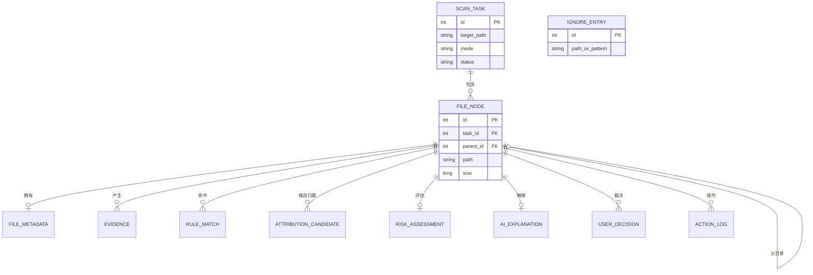

# CleanScope 数据模型设计（DATA v1.0）

> 上游依据：[架构设计.md](架构设计.md)（§5 领域对象 + 证据链契约 + IStorage 隔离）、[技术选型决策.md](技术选型决策.md)（SQLite + Microsoft.Data.Sqlite，**第一阶段不用 EF Core**）、[安全设计.md](安全设计.md)（is_fact 区分 / 脱敏 / 先写日志后执行）、[风险分级细则.md](风险分级细则.md)（A–E 等级、evidence_chain 非空）。
> 阶段：⑤ 数据模型　｜　状态：设计稿，待评审　｜　**不含业务代码**（C# 仅为数据形状定义）。

---

## 0. 设计约束（来自上游冻结决议）

| 约束 | 落点 |
|---|---|
| 经 `IStorage / Repository` 接口访问，核心层不依赖 SQLite（架构决议4） | 所有表的读写经仓储接口，领域模块不写裸 SQL |
| 不用 EF Core | 用 Microsoft.Data.Sqlite + 手写 SQL/轻量映射；本文件给 DDL 与 POCO 形状，不给 ORM 映射 |
| 证据链非空（SR-5） | `risk_assessment.evidence_chain` 非空约束 |
| 区分事实/推测（安全设计§9） | `evidence.is_fact` 必填 |
| AI 解释未校验不展示（架构§5） | `ai_explanation.validated` 标记 |
| 本地优先、不存内容、脱敏边界（PR-1/3/4） | 见 §6 敏感度分级 + §7 云端边界 |
| 先写审计后执行（SR-9） | `action_log` 在操作前落库 |

---

## 1. 实体关系（ER 图）



> `IGNORE_ENTRY`（忽略名单）是**全局表**，不绑定单次扫描任务（跨任务持续生效），故独立。

---

## 2. 实体清单与关系

| 实体 | 表名 | 关系 | 基数 | 说明 |
|---|---|---|---|---|
| 扫描任务 | `scan_task` | 根 | 1 | 一次扫描 |
| 文件/目录 | `file_node` | 属于任务；自引用父目录 | task 1:N | 扫描出的节点（含目录树） |
| 文件元数据 | `file_metadata` | 属于节点 | 1:0..1 | 签名/版本/占用等 |
| 证据 | `evidence` | 属于节点 | 1:N | 证据链原子项，区分事实/推测 |
| 规则匹配 | `rule_match` | 属于节点 | 1:N | 规则库命中（权威） |
| 归因候选 | `attribution_candidate` | 属于节点 | 1:N | 候选归属列表（非单值） |
| 风险评估 | `risk_assessment` | 属于节点 | 1:0..1 | A–E + 评分 + 证据链 |
| AI 解释 | `ai_explanation` | 属于节点 | 1:0..1 | 结构化解释，validated 控制展示 |
| 用户决策 | `user_decision` | 属于节点 | 1:N | 已处理/忽略/以后提醒 |
| 忽略名单 | `ignore_entry` | 全局 | — | 跨任务持续生效 |
| 操作日志 | `action_log` | 关联节点/路径 | 1:N | 审计，先写后执行 |

---

## 3. 全局约定

| 约定 | 取值 |
|---|---|
| 主键 | `id INTEGER PRIMARY KEY`（SQLite rowid，自增） |
| 外键 | `xxx_id INTEGER`，开启 `PRAGMA foreign_keys=ON` |
| 时间 | `TEXT`，ISO-8601 UTC（如 `2026-06-14T08:30:00Z`） |
| 布尔 | `INTEGER`，0/1 |
| 大小 | `INTEGER`（字节；SQLite INTEGER 为 8 字节，足够） |
| 枚举 | `TEXT`（可读优先，如 risk_level='D'） |
| 结构化集合 | `TEXT`（JSON 字符串，如 evidence_chain、reasoning） |
| 敏感度 | 每列标 **P0 公开 / P1 敏感(PII) / P2 机密**（见 §6） |

> JSON 列（如 `evidence_chain`）在 SQLite 内以 TEXT 存储，查询时可用 `json_*` 函数；这是"轻量映射不用 EF"下的务实选择。

---

## 4. 表结构（DDL）+ 字段含义 + 敏感度

> 每张表后标注：字段含义、敏感度（P0/P1/P2）、是否可上云端 AI（✓/✗）。

### 4.1 scan_task 扫描任务

```sql
CREATE TABLE scan_task (
  id           INTEGER PRIMARY KEY,
  target_path  TEXT NOT NULL,                 -- 扫描目标根路径
  mode         TEXT NOT NULL,                 -- Normal | Admin
  status       TEXT NOT NULL,                 -- Pending|Running|Completed|Interrupted|Failed
  started_at   TEXT NOT NULL,
  finished_at  TEXT,
  total_size   INTEGER,                       -- 累计扫描字节
  file_count   INTEGER,                       -- 文件数
  app_version  TEXT NOT NULL                  -- 产生数据的应用版本(可追溯)
);
```
| 字段 | 含义 | 敏感度 | 上云 |
|---|---|---|---|
| target_path | 扫描根（多为盘符/目录） | P1 | ✗ 原值；脱敏后✓ |
| mode | 权限模式 | P0 | ✓ |
| status/started_at/finished_at | 任务状态与时间 | P0 | ✓ |
| total_size/file_count | 统计量 | P0 | ✓ |
| app_version | 应用版本 | P0 | ✓ |

### 4.2 file_node 文件/目录节点

```sql
CREATE TABLE file_node (
  id                INTEGER PRIMARY KEY,
  task_id           INTEGER NOT NULL REFERENCES scan_task(id),
  parent_id         INTEGER REFERENCES file_node(id),   -- 目录树自引用, 根为 NULL
  path              TEXT NOT NULL,            -- 完整路径(原始)
  real_path         TEXT,                     -- 解析符号链接后的真实路径(IR-4防护)
  name              TEXT NOT NULL,            -- 文件/目录名
  is_directory      INTEGER NOT NULL,
  is_reparse_point  INTEGER NOT NULL DEFAULT 0, -- 是否 symlink/junction
  size              INTEGER NOT NULL,         -- 字节(目录为聚合大小)
  node_type         TEXT,                     -- File|Directory|Installer|Cache|Log|Database|Dump|Archive|VirtualDisk|Unknown
  mtime             TEXT,                     -- 最近修改
  atime             TEXT,                     -- 最近访问(弱参考)
  access_state      TEXT NOT NULL,            -- Accessible|NeedAdmin|Denied
  preliminary_class TEXT,                     -- System|App|UserData|Cache|Unknown 初步分类
  created_at        TEXT NOT NULL
);
CREATE INDEX ix_filenode_task_size ON file_node(task_id, size DESC); -- TopN 查询
CREATE INDEX ix_filenode_parent     ON file_node(parent_id);
```
| 字段 | 含义 | 敏感度 | 上云 |
|---|---|---|---|
| path / real_path / name | 路径与名称（可能含用户名、文档名） | **P1** | ✗ 原值；脱敏后✓ |
| size / node_type / mtime / atime | 大小/类型/时间 | P0 | ✓ |
| access_state / preliminary_class / is_reparse_point | 权限/初分类/链接标记 | P0 | ✓ |

### 4.3 file_metadata 文件元数据

```sql
CREATE TABLE file_metadata (
  file_id            INTEGER PRIMARY KEY REFERENCES file_node(id),
  extension          TEXT,                    -- 扩展名
  description        TEXT,                    -- 文件说明(版本资源)
  product_name       TEXT,                    -- 产品名
  company_name       TEXT,                    -- 公司名
  file_version       TEXT,
  is_signed          INTEGER,                 -- 是否数字签名
  signer             TEXT,                    -- 签名者(如 Microsoft Corporation)
  sha256             TEXT,                    -- 内容哈希摘要(非内容本身)
  in_use             INTEGER,                 -- 是否被进程占用
  occupying_process  TEXT                     -- 占用进程名
);
```
| 字段 | 含义 | 敏感度 | 上云 |
|---|---|---|---|
| extension/product_name/company_name/file_version/is_signed/signer | 元数据，归因关键 | P0 | ✓ |
| description | 文件说明 | P0（一般）| ✓ |
| sha256 | 内容哈希摘要（不可逆，非内容） | P0 | ✓ |
| in_use | 是否占用 | P0 | ✓ |
| occupying_process | 占用进程名（进程**路径**可能含用户名） | **P1** | 仅进程名✓；含路径✗ |

### 4.4 evidence 证据（证据链原子项）

```sql
CREATE TABLE evidence (
  id          INTEGER PRIMARY KEY,
  file_id     INTEGER NOT NULL REFERENCES file_node(id),
  kind        TEXT NOT NULL,    -- PathRule|Metadata|Signature|InstalledApp|Registry|Process|PackageMgr|Extension|AiInference
  value       TEXT NOT NULL,    -- 证据内容(如 "路径前缀 C:\Windows\Installer")
  source      TEXT,             -- 证据来源(如 "注册表 Uninstall 项")
  is_fact     INTEGER NOT NULL, -- 1=事实证据 0=AI推测(安全设计§9)
  weight      REAL,             -- 归因/风险加权
  created_at  TEXT NOT NULL
);
CREATE INDEX ix_evidence_file ON evidence(file_id);
```
| 字段 | 含义 | 敏感度 | 上云 |
|---|---|---|---|
| kind / is_fact / weight | 证据类型/事实标记/权重 | P0 | ✓ |
| value / source | 证据内容（可能含路径） | **P1** | 脱敏后✓ |

> **is_fact 是安全契约**：归因/风险的权威结论只能由 `is_fact=1` 的证据支撑；`is_fact=0`（AI 推测）仅供解释（安全设计 §9）。

### 4.5 rule_match 规则匹配（权威）

```sql
CREATE TABLE rule_match (
  id                 INTEGER PRIMARY KEY,
  file_id            INTEGER NOT NULL REFERENCES file_node(id),
  rule_id            TEXT NOT NULL,   -- 规则库条目id(如 win-installer-cache)
  category           TEXT,            -- 类别(如 Windows Installer Cache)
  risk_level         TEXT,            -- A|B|C|D|E (来自规则库)
  direct_delete      INTEGER,         -- 规则是否允许直删
  is_system_critical INTEGER,         -- 是否系统关键(黑名单)
  recommended_action TEXT,
  confidence         REAL,
  priority           INTEGER,         -- 规则优先级(冲突时就高)
  authoritative      INTEGER NOT NULL DEFAULT 1  -- 规则权威, AI不可覆盖
);
CREATE INDEX ix_rulematch_file ON rule_match(file_id);
```
| 字段 | 含义 | 敏感度 | 上云 |
|---|---|---|---|
| 全部字段 | 规则裁决结果（无 PII） | P0 | ✓ |

### 4.6 attribution_candidate 归因候选（列表，非单值）

```sql
CREATE TABLE attribution_candidate (
  id                     INTEGER PRIMARY KEY,
  file_id                INTEGER NOT NULL REFERENCES file_node(id),
  app_name               TEXT NOT NULL,  -- 候选归属应用
  confidence             REAL NOT NULL,  -- 置信度
  rank                   INTEGER,        -- 排名
  supporting_evidence_ids TEXT           -- JSON: 支撑证据id数组
);
CREATE INDEX ix_attr_file ON attribution_candidate(file_id);
```
| 字段 | 含义 | 敏感度 | 上云 |
|---|---|---|---|
| app_name/confidence/rank | 候选归属与置信 | P0 | ✓ |
| supporting_evidence_ids | 支撑证据引用 | P0 | ✓（引用id，不含内容）|

### 4.7 risk_assessment 风险评估（权威，1:0..1）

```sql
CREATE TABLE risk_assessment (
  id                  INTEGER PRIMARY KEY,
  file_id             INTEGER NOT NULL UNIQUE REFERENCES file_node(id),
  level               TEXT NOT NULL,    -- A|B|C|D|E
  score               INTEGER NOT NULL, -- 0-100
  factors             TEXT,             -- JSON: 评分因素
  evidence_chain      TEXT NOT NULL,    -- JSON: 证据id数组, 非空(SR-5)
  can_delete_directly INTEGER NOT NULL,
  confidence          REAL,
  created_at          TEXT NOT NULL,
  CHECK (length(evidence_chain) > 2)   -- 防空数组 "[]"
);
```
| 字段 | 含义 | 敏感度 | 上云 |
|---|---|---|---|
| level/score/factors/can_delete_directly/confidence | 风险结论 | P0 | ✓ |
| evidence_chain | 证据链（id 引用，非空） | P0 | ✓ |

> `CHECK(length>2)` + 应用层校验双保险，确保 SR-5「无证据不出结论」。

### 4.8 ai_explanation AI 解释（1:0..1）

```sql
CREATE TABLE ai_explanation (
  id                        INTEGER PRIMARY KEY,
  file_id                   INTEGER NOT NULL UNIQUE REFERENCES file_node(id),
  what_is_it                TEXT,
  owner_app                 TEXT,
  risk_level                TEXT,      -- AI给的等级(不得低于引擎, 由校验器保证)
  can_delete_directly       INTEGER,
  recommended_action        TEXT,
  reasoning                 TEXT,      -- JSON: 判断依据数组
  confidence                REAL,
  user_friendly_explanation TEXT,
  validated                 INTEGER NOT NULL DEFAULT 0, -- 0=未校验不展示
  model_used                TEXT,      -- 模型标识(本地/云端)
  is_cloud                  INTEGER NOT NULL DEFAULT 0, -- 是否走了云端
  created_at                TEXT NOT NULL
);
```
| 字段 | 含义 | 敏感度 | 上云 |
|---|---|---|---|
| 解释各字段 | AI 输出（基于已脱敏输入生成） | P0 | ✓（已是脱敏产物）|
| validated | 是否通过校验器（false 禁止展示） | P0 | — |
| model_used/is_cloud | 模型与是否云端（隐私审计用） | P0 | — |

### 4.9 user_decision 用户决策

```sql
CREATE TABLE user_decision (
  id         INTEGER PRIMARY KEY,
  file_id    INTEGER NOT NULL REFERENCES file_node(id),
  decision   TEXT NOT NULL,   -- Processed|Ignored|RemindLater
  note       TEXT,            -- 用户自由备注
  decided_at TEXT NOT NULL
);
```
| 字段 | 含义 | 敏感度 | 上云 |
|---|---|---|---|
| decision/decided_at | 决策与时间 | P0 | ✓ |
| note | 用户自由文本（可能含隐私） | **P2 机密** | ✗ 永不上云 |

### 4.10 ignore_entry 忽略名单（全局）

```sql
CREATE TABLE ignore_entry (
  id              INTEGER PRIMARY KEY,
  path_or_pattern TEXT NOT NULL,  -- 路径或匹配模式
  match_type      TEXT NOT NULL,  -- Exact|Prefix|Glob
  reason          TEXT,           -- 用户填写原因
  created_at      TEXT NOT NULL
);
```
| 字段 | 含义 | 敏感度 | 上云 |
|---|---|---|---|
| path_or_pattern | 忽略目标 | **P1** | ✗（本地匹配用，无需上云）|
| match_type | 匹配方式 | P0 | — |
| reason | 用户原因 | **P2** | ✗ |

### 4.11 action_log 操作日志（审计，先写后执行）

```sql
CREATE TABLE action_log (
  id                   INTEGER PRIMARY KEY,
  file_id              INTEGER REFERENCES file_node(id),  -- 可空(按路径操作)
  target_path          TEXT,            -- 操作目标
  action               TEXT NOT NULL,   -- OpenDir|CopyPath|OpenSettings|ShowCommand|AddIgnore|ExportReport|MoveToRecycleBin
  before_state         TEXT,            -- JSON: 操作前状态快照
  recycle_bin_location TEXT,            -- 删除后回收站定位(可恢复)
  recoverable          INTEGER NOT NULL,-- 是否可恢复
  operator             TEXT NOT NULL,   -- User|System
  result               TEXT NOT NULL,   -- Success|Rejected|Failed
  reject_reason        TEXT,            -- 被拒原因(如命中黑名单)
  app_version          TEXT NOT NULL,
  timestamp            TEXT NOT NULL
);
CREATE INDEX ix_actionlog_time ON action_log(timestamp DESC);
```
| 字段 | 含义 | 敏感度 | 上云 |
|---|---|---|---|
| target_path / recycle_bin_location | 操作/恢复路径 | **P1** | ✗ |
| action/recoverable/operator/result/reject_reason | 审计要素 | P0 | ✗（审计仅本地）|
| before_state | 状态快照 | P1 | ✗ |

> **action_log 整表仅本地**：审计是安全/合规资产，无需也不应上云。

---

## 5. C# 数据类设计（仅形状，无业务逻辑）

> 放在 `CleanScope.Domain/Entities`。用 `record`（不可变优先）+ 枚举。**不含 EF 特性、不含方法**；持久化映射由 `CleanScope.Infrastructure` 的仓储手写 SQL 完成（技术决议8）。

```csharp
// ---- 枚举（与 TEXT 列对应）----
public enum ScanMode { Normal, Admin }
public enum ScanStatus { Pending, Running, Completed, Interrupted, Failed }
public enum AccessState { Accessible, NeedAdmin, Denied }
public enum NodeType { File, Directory, Installer, Cache, Log, Database, Dump, Archive, VirtualDisk, Unknown }
public enum PreliminaryClass { System, App, UserData, Cache, Unknown }
public enum RiskLevel { A, B, C, D, E }          // 风险分级细则
public enum EvidenceKind { PathRule, Metadata, Signature, InstalledApp, Registry, Process, PackageMgr, Extension, AiInference }
public enum DecisionType { Processed, Ignored, RemindLater }
public enum MatchType { Exact, Prefix, Glob }
public enum ActionType { OpenDir, CopyPath, OpenSettings, ShowCommand, AddIgnore, ExportReport, MoveToRecycleBin }
public enum ActionResult { Success, Rejected, Failed }
public enum Operator { User, System }

// ---- 数据敏感度标注（供脱敏网关读取的约定）----
public enum Sensitivity { P0_Public, P1_Pii, P2_Secret }

// ---- 实体形状（节选关键字段；省略号表示其余列同 DDL）----
public record ScanTask(long Id, string TargetPath, ScanMode Mode, ScanStatus Status,
    DateTime StartedAt, DateTime? FinishedAt, long? TotalSize, long? FileCount, string AppVersion);

public record FileNode(long Id, long TaskId, long? ParentId, string Path, string? RealPath,
    string Name, bool IsDirectory, bool IsReparsePoint, long Size, NodeType? NodeType,
    DateTime? Mtime, DateTime? Atime, AccessState AccessState,
    PreliminaryClass? PreliminaryClass, DateTime CreatedAt);

public record FileMetadata(long FileId, string? Extension, string? Description, string? ProductName,
    string? CompanyName, string? FileVersion, bool? IsSigned, string? Signer, string? Sha256,
    bool? InUse, string? OccupyingProcess);

public record Evidence(long Id, long FileId, EvidenceKind Kind, string Value, string? Source,
    bool IsFact, double? Weight, DateTime CreatedAt);

public record RuleMatch(long Id, long FileId, string RuleId, string? Category, RiskLevel? RiskLevel,
    bool? DirectDelete, bool? IsSystemCritical, string? RecommendedAction, double? Confidence,
    int? Priority, bool Authoritative);

public record AttributionCandidate(long Id, long FileId, string AppName, double Confidence,
    int? Rank, IReadOnlyList<long> SupportingEvidenceIds);   // JSON 列映射为列表

public record RiskAssessment(long Id, long FileId, RiskLevel Level, int Score,
    IReadOnlyList<string> Factors, IReadOnlyList<long> EvidenceChain,  // 非空
    bool CanDeleteDirectly, double? Confidence, DateTime CreatedAt);

public record AiExplanation(long Id, long FileId, string? WhatIsIt, string? OwnerApp,
    RiskLevel? RiskLevel, bool? CanDeleteDirectly, string? RecommendedAction,
    IReadOnlyList<string> Reasoning, double? Confidence, string? UserFriendlyExplanation,
    bool Validated, string? ModelUsed, bool IsCloud, DateTime CreatedAt);

public record UserDecision(long Id, long FileId, DecisionType Decision, string? Note, DateTime DecidedAt);

public record IgnoreEntry(long Id, string PathOrPattern, MatchType MatchType, string? Reason, DateTime CreatedAt);

public record ActionLog(long Id, long? FileId, string? TargetPath, ActionType Action,
    string? BeforeState, string? RecycleBinLocation, bool Recoverable, Operator Operator,
    ActionResult Result, string? RejectReason, string AppVersion, DateTime Timestamp);
```

> 仓储接口（在 `Domain/Abstractions`，本阶段只示意，不实现）：`IScanTaskRepository`、`IFileNodeRepository`、`IRiskRepository`、`IIgnoreRepository`、`IAuditLogRepository` 等，均经 `IStorage` 取连接。**领域/核心模块只见接口，不见 SQLite。**

---

## 6. 脱敏与敏感度分级（汇总）

三级分类，决定"本地怎么存、能不能上云"：

| 级别 | 定义 | 本地存储 | 上云端 AI |
|---|---|---|---|
| **P0 公开** | 无个人信息（大小/类型/扩展名/风险等级/类别/置信度/证据种类/签名者） | 明文 | ✓ 可直接用 |
| **P1 敏感(PII)** | 可能含用户名/文档名/隐私（完整路径、文件名、real_path、证据 value、占用进程路径、忽略路径、审计路径） | 明文（本地优先，操作需要） | ✗ 原值；**必须脱敏后**才可上云 |
| **P2 机密** | 用户主观/强隐私（用户备注 note、忽略原因 reason） | 明文 | ✗ **永不上云** |

**脱敏规则（P1 → 可上云形态）：**
- 用户名替换：`C:\Users\张三\...` → `C:\Users\%USER%\...`
- 文档名泛化：保留扩展名与目录类别，文件名替换为占位（`paper.docx` → `%FILE%.docx`），或仅传"路径模式 + 类别"而非具体名。
- 进程：仅传进程名（如 `devenv.exe`），不传其完整路径。
- 脱敏由 `SanitizationGateway` 统一执行，是出云**唯一通道**（IR-7）。

---

## 7. 哪些不应上传云端 AI（明确清单）

**绝对不上云（✗）：**
- 任何**文件内容**（系统根本不存储，从源头杜绝，PR-1）。
- `action_log` 整表（审计仅本地）。
- `user_decision.note`、`ignore_entry.reason`（P2 机密）。
- 任何 **P1 字段的原始值**（完整路径、文件名、real_path、证据 value 原文、占用进程路径、忽略/审计路径）——只能以**脱敏形态**出云。

**可上云（✓，构成 AI 输入摘要）：**
- 脱敏后的路径模式、扩展名、大小、node_type、preliminary_class。
- rule_match 全部字段（类别、风险等级、是否系统关键…）。
- attribution_candidate（应用名 + 置信度）。
- risk_assessment（等级、评分、证据链 id 引用）。
- evidence 中 **is_fact=1** 的脱敏 value + kind（事实证据优先；AI 推测类证据本就不需回传给 AI）。

> 这正是架构 §8「AI 调用边界」入站清单的数据层落地：**AI 只看脱敏事实摘要，看不到原始隐私。**

---

## 8. 示例数据

以"Visual Studio 安装包缓存目录"为例，贯穿各表（节选关键列）：

```jsonc
// scan_task
{ "id":1, "target_path":"C:\\", "mode":"Normal", "status":"Completed",
  "started_at":"2026-06-14T08:00:00Z", "finished_at":"2026-06-14T08:03:12Z",
  "total_size":210000000000, "file_count":984213, "app_version":"0.1.0" }

// file_node
{ "id":501, "task_id":1, "parent_id":480,
  "path":"C:\\ProgramData\\Package Cache\\{4F2A...GUID}",
  "real_path":"C:\\ProgramData\\Package Cache\\{4F2A...GUID}",
  "name":"{4F2A...GUID}", "is_directory":1, "is_reparse_point":0,
  "size":4509715660, "node_type":"Installer", "mtime":"2025-11-02T11:20:00Z",
  "access_state":"Accessible", "preliminary_class":"System", "created_at":"2026-06-14T08:02:50Z" }

// file_metadata
{ "file_id":501, "extension":"", "company_name":"Microsoft Corporation",
  "is_signed":1, "signer":"Microsoft Corporation", "in_use":0 }

// evidence (证据链)
{ "id":9001, "file_id":501, "kind":"PathRule", "value":"路径位于 ProgramData\\Package Cache",
  "source":"规则 win-package-cache", "is_fact":1, "weight":0.9 }
{ "id":9002, "file_id":501, "kind":"PathRule", "value":"目录名为 GUID 形态",
  "source":"path pattern", "is_fact":1, "weight":0.5 }
{ "id":9003, "file_id":501, "kind":"InstalledApp", "value":"匹配已安装 Visual Studio",
  "source":"注册表 Uninstall", "is_fact":1, "weight":0.8 }

// rule_match (权威)
{ "id":7001, "file_id":501, "rule_id":"win-package-cache", "category":"Package Cache",
  "risk_level":"D", "direct_delete":0, "is_system_critical":1,
  "recommended_action":"用 Visual Studio Installer 管理缓存，勿直删", "confidence":0.95,
  "priority":100, "authoritative":1 }

// attribution_candidate (候选列表)
{ "id":6001, "file_id":501, "app_name":"Visual Studio", "confidence":0.82, "rank":1,
  "supporting_evidence_ids":[9001,9003] }
{ "id":6002, "file_id":501, "app_name":"Microsoft Build Tools", "confidence":0.40, "rank":2,
  "supporting_evidence_ids":[9001] }

// risk_assessment (权威, evidence_chain 非空)
{ "id":5001, "file_id":501, "level":"D", "score":78,
  "factors":["命中Package Cache黑名单","与已安装VS匹配"],
  "evidence_chain":[9001,9002,9003], "can_delete_directly":0, "confidence":0.85,
  "created_at":"2026-06-14T08:03:00Z" }

// ai_explanation (validated=1 才展示)
{ "id":4001, "file_id":501, "what_is_it":"Visual Studio 安装包缓存",
  "owner_app":"Visual Studio", "risk_level":"D", "can_delete_directly":0,
  "recommended_action":"使用 VS Installer 缓存管理，不要直接删除整个目录",
  "reasoning":["路径在 Package Cache","目录名为GUID","与已安装VS匹配"],
  "confidence":0.82, "user_friendly_explanation":"这是 Visual Studio 的安装缓存……",
  "validated":1, "model_used":"local-small", "is_cloud":0, "created_at":"2026-06-14T08:03:05Z" }

// action_log (用户点了"复制路径"; 删除在MVP会是 Rejected)
{ "id":3001, "file_id":501, "target_path":"C:\\ProgramData\\Package Cache\\{4F2A...}",
  "action":"CopyPath", "recoverable":1, "operator":"User", "result":"Success",
  "app_version":"0.1.0", "timestamp":"2026-06-14T08:05:00Z" }
```

**上云脱敏后**，传给 AI 的摘要（仅 P0 + 脱敏 P1）：
```jsonc
{ "path_pattern":"%SystemDrive%\\ProgramData\\Package Cache\\{GUID}",
  "size":"4.2GB", "extension":"", "node_type":"Installer",
  "matched_rule":"Package Cache", "risk_level":"D", "is_system_critical":true,
  "related_apps":[{"name":"Visual Studio","confidence":0.82}],
  "facts":["路径在 Package Cache","目录名为GUID","匹配已安装VS"], "confidence":0.85 }
```
> 对比可见：**真实路径、GUID 原值、公司账户等均未出云**，AI 仅凭脱敏事实摘要生成解释。

---

## 9. 与 IStorage / 仓储接口的衔接

```text
Domain (实体 + 仓储接口 IXxxRepository, IStorage)
   ▲ 依赖接口
Core (六模块) ── 调用 ──▶ 仓储接口（拿不到 SQLite 细节）
Infrastructure ── 实现 ──▶ Microsoft.Data.Sqlite + 手写 SQL（DDL 见本文件）
```
- 数据库文件位于**用户数据目录**（如 `%LocalAppData%\CleanScope\cleanscope.db`），**不进 Git 仓库**。
- 建库脚本（DDL）由 Infrastructure 在首次启动迁移，版本化管理 schema。
- 仓储负责 record ↔ 表 的手写映射、JSON 列序列化。

---

## 10. 评审关注点

1. 目录树用 `parent_id` 自引用（支持目录聚合/下钻），还是只存扁平节点？建议自引用（当前设计）。
2. 三级敏感度（P0/P1/P2）与"P1 必脱敏、P2 永不上云、action_log 仅本地"是否认可？
3. `risk_assessment.evidence_chain` 用 `CHECK + 应用层`双重非空，是否足够保障 SR-5？
4. JSON 列（evidence_chain/reasoning/factors）存 TEXT 是否接受（不用 EF 下的务实选择）？
5. 是否确认后进入 **阶段⑤ 知识库清单**（`知识库-目录规则.md`），随后阶段⑥模块拆分。

> 评审通过后，数据模型与知识库清单共同构成阶段⑥模块拆分前的最后输入。
```
