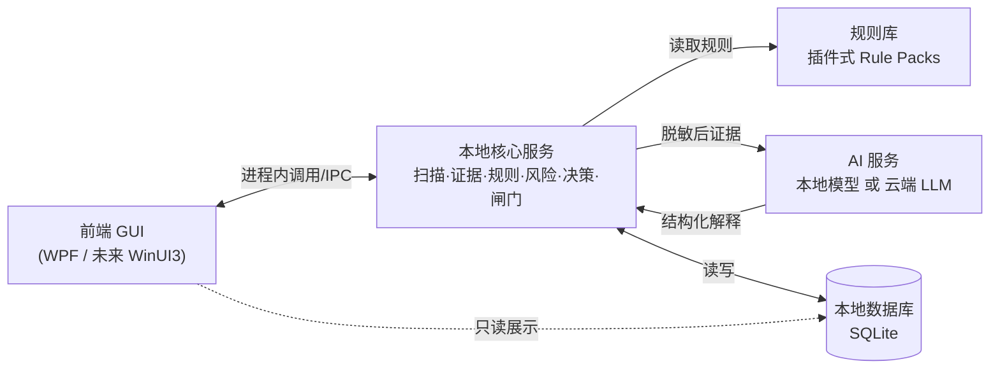
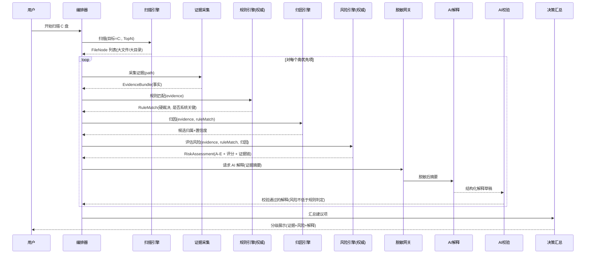
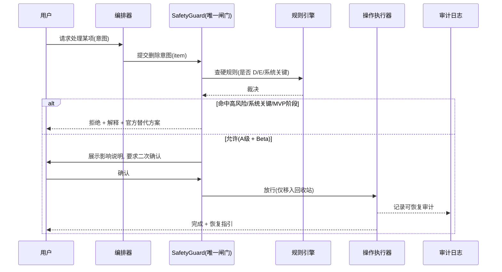
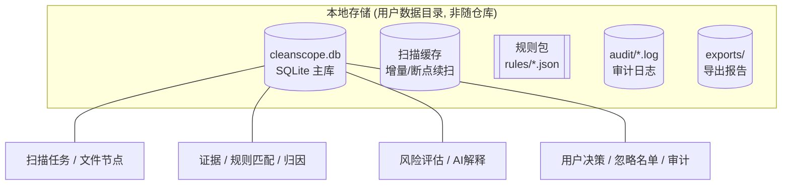
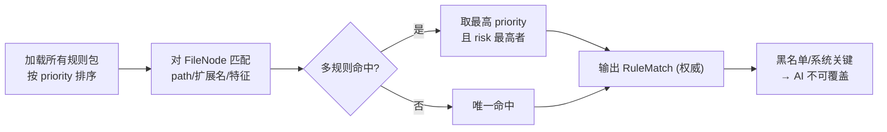
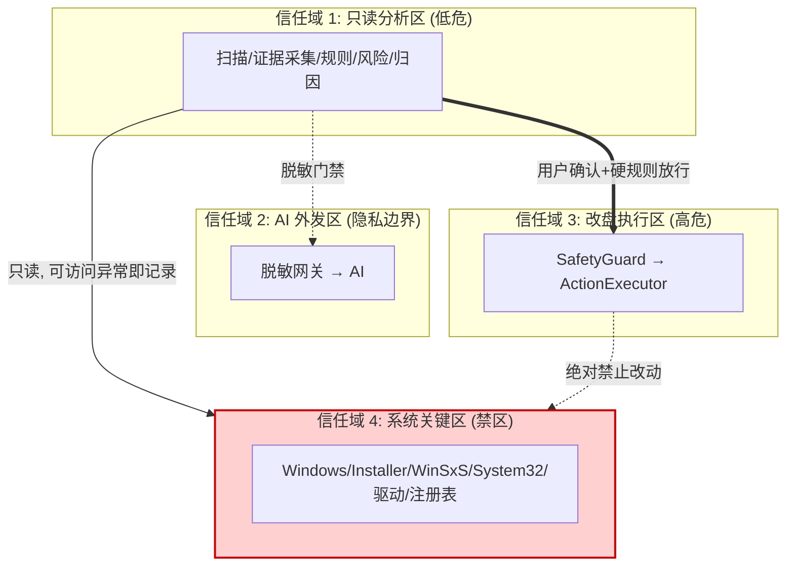

# CleanScope 产品级架构设计（ARCH v1.0）

> 上游依据：[需求冻结文档.md](需求冻结文档.md)（四条产品宪法 + 安全红线 SR-1～10 + 隐私红线 PR-1～7 + MVP 零删除）。
> 本文档把需求宪法**翻译成架构约束**——让"AI 不能决定删除""判断必带证据链""规则优先于 AI""删除必经安全闸门"成为**结构上无法绕过**的设计，而非靠开发自觉。
> 阶段：② 架构设计　｜　状态：设计稿，待评审　｜　不含实现代码。

---

## 0. 架构设计三条最高约束（贯穿全文）

| 编号 | 架构约束 | 它强制了哪条需求 |
|---|---|---|
| **A-1 单向裁决** | 删除决策只能沿 `规则引擎 → 风险引擎 → 安全闸门 → 用户` 单向流动；AI 不在这条链上 | 宪法①④、SR-1/5/6 |
| **A-2 AI 旁路** | AI 只接收"已脱敏证据"、只输出"解释"，其输出经校验后才允许展示，**永不直接驱动操作** | 宪法②、SR-5/6/7、PR-1/3 |
| **A-3 闸门唯一** | 所有"会改变磁盘的操作"必须经过唯一的 `SafetyGuard`，不存在第二条执行路径 | SR-1/2/3/4、宪法① |

> 这三条是"地基"。后面所有模块划分、数据流、边界设计都服务于让这三条在结构上不可违反。

---

## 1. 总体架构图

采用**分层 + 旁路 AI + 单一安全闸门**架构。核心链路（扫描→证据→规则→风险→决策）是"主干"，AI 是挂在主干旁的"解释器"，删除操作收口于唯一闸门。

```mermaid
flowchart TB
    subgraph UI["① 表现层 (Presentation)"]
        UIView["视图: 首页/列表/详情/清理建议/安全确认"]
        UIVM["视图模型 (ViewModel)"]
    end

    subgraph APP["② 应用编排层 (Application / Use Cases)"]
        Orchestrator["用例编排器\n扫描·分析·解释·决策流程"]
    end

    subgraph CORE["③ 核心领域层 (Domain Core) —— 主干裁决链"]
        Scan["扫描引擎\nScanEngine"]
        Evidence["证据采集层\nEvidenceCollector"]
        Rule["规则引擎 + 知识库\nRuleEngine (权威)"]
        Attr["归因引擎\nAttributionEngine"]
        Risk["风险评估引擎\nRiskEngine (权威)"]
        Decision["决策汇总\nDecisionService"]
    end

    subgraph AISIDE["④ AI 旁路 (Advisory, 非裁决)"]
        Sanitizer["脱敏网关\nSanitizationGateway"]
        AIClient["AI 解释服务\nExplanationService"]
        AIValidator["AI 输出校验器\nAI Output Validator"]
    end

    subgraph GUARD["⑤ 安全闸门 (唯一可改盘路径)"]
        SafetyGuard["SafetyGuard\n硬规则拦截 + 双确认 + 仅回收站"]
        Action["操作执行器\nActionExecutor"]
    end

    subgraph INFRA["⑥ 基础设施层 (Infrastructure)"]
        DB[("SQLite\n本地数据库")]
        Cache[("扫描缓存")]
        Log[("操作日志/审计")]
        WinAPI["Windows 系统访问\n文件系统/注册表/进程/签名"]
        Report["报告生成器\nReportExporter"]
    end

    UIView <--> UIVM
    UIVM <--> Orchestrator
    Orchestrator --> Scan --> Evidence --> Rule --> Attr --> Risk --> Decision
    Decision --> Orchestrator

    Risk -.结构化证据摘要.-> Sanitizer --> AIClient --> AIValidator
    AIValidator -.仅"解释"文本.-> Decision

    Orchestrator ==用户确认后==> SafetyGuard
    Rule == 硬规则裁决 ==> SafetyGuard
    Risk == 风险等级 ==> SafetyGuard
    SafetyGuard --> Action --> WinAPI

    Scan --> WinAPI
    Evidence --> WinAPI
    Scan --> Cache
    CORE --> DB
    Action --> Log
    Decision --> Report
    Rule -. 加载 .- KB[["规则库插件\nRule Packs (.json/.yaml)"]]

    classDef authoritative fill:#ffe0e0,stroke:#c00,stroke-width:2px;
    classDef advisory fill:#e0e8ff,stroke:#4466cc;
    classDef gate fill:#fff0c0,stroke:#cc8800,stroke-width:2px;
    class Rule,Risk authoritative;
    class Sanitizer,AIClient,AIValidator advisory;
    class SafetyGuard,Action gate;
```

**图例：** 红=权威裁决模块（规则/风险，AI 不可覆盖）；蓝=AI 旁路（仅建议）；黄=安全闸门（唯一可改盘路径）。注意 AI 用虚线连接，且**不与 SafetyGuard 相连**——AI 在结构上无法触发任何删除。

---

## 2. 前端/本地服务/AI 服务/规则库/数据库 之间的关系

CleanScope 是**单机桌面应用**，但内部按"前端 / 本地核心服务 / AI 服务 / 规则库 / 数据库"五块解耦，便于未来把核心服务独立成进程或迁移技术栈。



| 关系 | 说明 | 边界约束 |
|---|---|---|
| 前端 ↔ 核心 | 前端只发"意图"（扫描/解释/确认删除），不直接碰文件系统 | 前端无删除权限，删除意图须经核心的 SafetyGuard |
| 核心 → 规则库 | 启动时加载规则包，规则裁决在核心内完成 | 规则库是数据(可热更新)，不含可执行逻辑 |
| 核心 → AI | 只发**脱敏结构化证据**，收回**纯解释文本** | AI 不接触原始路径内容；AI 输出经校验才用 |
| 核心 ↔ DB | 扫描结果、证据、风险、决策、日志持久化 | 标记脱敏列；敏感字段不外传 |
| 前端 → DB | 仅只读展示历史结果 | 不绕过核心写数据 |

**关键解耦点：** 前端、AI、规则库都是"可替换插件"——换 GUI 框架、换模型、扩规则，都不动核心裁决链。这正是需求里"后续要能扩展 GUI、规则库、AI 模型、报告系统"的架构落点。

---

## 3. 核心模块职责

> 按"主干裁决链 → AI 旁路 → 安全闸门 → 基础设施 → 横切关注点"分组。标 🔴 = 安全关键模块（不能让 AI 随便写代码，须谨慎设计 + 充分测试）。

### 3.1 主干裁决链（权威）

| 模块 | 职责（负责什么） | 不负责什么 |
|---|---|---|
| **ScanEngine 扫描引擎** | 遍历目录、聚合目录大小、维护 Top-N、处理无权限/符号链接、扫描缓存 | 不判断风险、不删除、不解释 |
| **EvidenceCollector 证据采集** | 采集元数据/数字签名/已安装软件/注册表卸载项/进程占用/包管理信息，封装成 `EvidenceBundle` | 不下结论；只摆事实，标注来源 |
| 🔴 **RuleEngine 规则引擎(权威)** | 加载规则库，按路径/扩展名/特征匹配，给出**硬规则裁决**（类别、是否系统关键、direct_delete 等） | 不猜测；命中黑名单即权威生效，AI 不可覆盖 |
| **AttributionEngine 归因引擎** | 多证据融合，输出**候选归属列表 + 置信度**（非单一答案） | 不做删除建议；归因不足时如实标"未知" |
| 🔴 **RiskEngine 风险引擎(权威)** | 综合规则裁决 + 归因 + 证据，输出 **A–E 五级风险 + 评分 + 证据链** | 不执行操作；风险等级是删除闸门的输入之一 |
| **DecisionService 决策汇总** | 汇总规则/风险/归因/AI 解释，生成面向用户的"建议项"，按风险分组 | 不自动执行；只产出"供用户裁决"的视图数据 |

### 3.2 AI 旁路（仅建议，非裁决）

| 模块 | 职责 | 边界 |
|---|---|---|
| 🔴 **SanitizationGateway 脱敏网关** | 把证据摘要中的用户名/文档名/隐私路径脱敏，裁剪为最小必要字段，**绝不含文件内容** | 所有出站到 AI 的数据**必须**经此网关，无旁路 |
| **ExplanationService AI 解释服务** | 调用本地/云端模型，把脱敏证据转成自然语言解释 + 结构化字段 | 只解释；不得输出可执行删除指令 |
| 🔴 **AI Output Validator 输出校验器** | 校验 AI 输出：必须带证据与置信度、风险等级不得低于规则引擎判定、禁止"确定可删"式断言；冲突则以规则为准并降级为"无法判断" | AI 结果须过校验才进入 DecisionService |

### 3.3 安全闸门（唯一可改盘路径）

| 模块 | 职责 | 边界 |
|---|---|---|
| 🔴 **SafetyGuard 安全闸门** | 删除前最后防线：硬规则拦截(D/E 禁删)、校验风险等级、强制双确认、强制仅回收站、记录审计 | **唯一**能触发 ActionExecutor 的入口；MVP 阶段直接拒绝一切删除 |
| 🔴 **ActionExecutor 操作执行器** | 执行已获闸门放行的操作（MVP 仅辅助操作：打开目录/复制路径/跳转设置/展示命令） | 不含永久删除代码路径；删除仅"移入回收站"(Beta 起) |

### 3.4 基础设施 + 横切

| 模块 | 职责 |
|---|---|
| **WindowsAccess 系统访问** | 封装文件系统/注册表/进程/数字签名读取，统一权限与异常处理 |
| **Persistence 持久化** | SQLite 读写、扫描缓存、忽略名单 |
| **AuditLog 审计日志** | 记录所有操作与删除决策，支持追溯与恢复指引(SR-9) |
| **ReportExporter 报告生成** | 导出 Markdown(MVP)/HTML/JSON/CSV |
| **PolicyConfig 策略配置** | 集中管理安全策略、隐私开关(本地/云端)、阈值 |

---

## 4. 模块间数据流

### 4.1 主流程：一次"扫描→解释→决策"



### 4.2 删除流程（Beta 起；MVP 在第 1 步即被拒绝）



> **MVP 现状：** SafetyGuard 对任何删除意图直接走"拒绝"分支——删除能力在结构上未接通，纯解释。

---

## 5. 关键数据结构（概念模型，详细表结构见 `数据模型设计.md`）

> 这里只定义**领域对象与字段语义**，固化"证据链"这一核心契约。落库设计在阶段⑤展开。

```text
ScanTask         扫描任务   { id, target_path, started_at, finished_at, status, mode(普通/管理员) }

FileNode         文件/目录  { id, task_id, path, size, type(文件/目录/安装包/缓存/日志/db…),
                              mtime, atime(弱参考), access_state(可访问/需管理员/拒绝), preliminary_class }

EvidenceBundle   证据集合   { file_id, evidences: [Evidence] }            ← 证据链的载体
Evidence         单条证据   { kind(path_rule|metadata|signature|installed_app|
                              registry|process|package_mgr|extension|ai_inference),
                              value, source(证据来源), is_fact(true=事实/false=推测), weight }

RuleMatch        规则裁决   { file_id, rule_id, category, risk_level, direct_delete(bool),
                              is_system_critical(bool), recommended_action, confidence, authoritative=true }

AttributionCandidate 归因候选 { file_id, app_name, confidence, supporting_evidence_ids[] }  ← 列表非单值

RiskAssessment   风险评估   { file_id, level(A|B|C|D|E), score(0-100),
                              factors[], evidence_chain[Evidence], can_delete_directly(bool) }

AIExplanation    AI解释     { file_id, what_is_it, owner_app, risk_level, can_delete_directly,
                              recommended_action, reasoning[], confidence,
                              user_friendly_explanation, validated(bool) }   ← validated=false 不展示

UserDecision     用户决策   { file_id, decision(已处理/忽略/以后提醒), note, decided_at }
IgnoreEntry      忽略项     { path_or_pattern, reason, created_at }
ActionLog        操作审计   { id, file_id, action, before_state, recycle_bin_location,
                              recoverable(bool), operator, timestamp }      ← 支撑可恢复
```

**契约要点：**
- 任何 `RiskAssessment` 必须携带非空 `evidence_chain`——无证据不出结论(SR-5)。
- `Evidence.is_fact` 强制区分"事实证据"与"AI 推测"(隐私/安全要求)。
- `AIExplanation.validated=false` 的解释**禁止展示给用户**。
- 归因永远是**候选列表 + 置信度**，不存在"武断单一答案"的数据结构。

---

## 6. 本地存储方案

**选型：SQLite（单文件嵌入式数据库）+ 文件缓存，经存储接口隔离。** 理由：单机、零运维、事务可靠、适合百万级文件索引、跨技术栈可迁移。

> **决策（已定稿）：SQLite 是默认实现，但核心层只依赖抽象的 `IStorage / Repository` 接口，不直接依赖 SQLite。** 这样未来换存储（如换嵌入式 KV、迁移技术栈、企业版换数据库）只替换实现，不动主干裁决链。所有持久化访问必须经接口，禁止在领域模块里写裸 SQL。



| 数据 | 存储 | 说明 |
|---|---|---|
| 结构化结果 | SQLite | 任务、文件、证据、风险、决策、日志 |
| 扫描缓存 | 文件/SQLite | 支持中断恢复、增量扫描、避免重复 |
| 规则库 | JSON/YAML 文件 | 插件式，可热更新，独立于代码 |
| 审计日志 | 追加式日志 | 可追溯、可恢复指引 |
| 报告 | 导出目录 | Markdown/HTML/JSON/CSV |

**安全/隐私约束：**
- 数据库存放在**用户数据目录**，绝不进 Git 仓库（呼应 PR-1/PR-4 与工程规范）。
- 含潜在隐私的字段（完整路径、文档名）在库内标记，**外发前必经脱敏网关**。
- 不存储任何文件内容，只存元数据、哈希摘要、路径。

---

## 7. 插件化规则库设计

规则库是产品的护城河，必须**与代码解耦、可独立更新、可社区贡献**。设计为"声明式规则包"，由 RuleEngine 加载，**规则是数据不是代码**（避免注入风险）。

### 7.1 规则包结构

```text
rules/
  00-system-critical.json     # 系统关键目录黑名单 (风险 D, 最高优先级)
  10-windows-installer.json    # Windows Installer / WinSxS / 更新缓存
  20-browsers.json             # 浏览器缓存
  30-dev-ide.json              # VS / JetBrains / VSCode
  31-dev-pkg.json              # npm/pip/conda/gradle/maven/nuget
  32-dev-container.json        # Docker / WSL 镜像
  40-games.json                # Steam / Epic
  50-temp-log-dump.json        # 临时/日志/转储
  90-cloud-sync.json           # 云盘同步目录
  user/                        # 用户/社区自定义规则 (低优先级)
```

### 7.2 单条规则字段（与知识库清单一致）

```json
{
  "id": "win-installer-cache",
  "pattern": "C:\\Windows\\Installer",
  "match_type": "path_prefix",
  "category": "Windows Installer Cache",
  "risk_level": "D",
  "direct_delete": false,
  "is_system_critical": true,
  "description": "Windows Installer 的安装/修复/更新/卸载缓存",
  "recommended_action": "不建议手动删除；如需释放空间，优先用系统或软件官方方式",
  "evidence_type": "path_rule",
  "confidence": 0.95,
  "priority": 100
}
```

### 7.3 规则引擎工作机制



**关键设计：**
- **优先级 + 风险就高不就低**：冲突时取更保守结果（安全优先）。
- **系统关键规则优先级最高**，一旦命中即权威生效，AI 解释只能"解释"不能"翻案"。
- **热更新（v1.0）**：规则包可单独更新而不重新发布应用。
- **用户/社区规则优先级最低**，且不能放宽系统关键目录（防止误配置降低安全）。

---

## 8. AI 调用边界（最关键的安全边界之一）

AI 在本架构中是**受限的旁路解释器**，其能力边界由结构保证：

```mermaid
flowchart LR
    subgraph In["AI 能拿到什么 (入)"]
        I1["脱敏路径模式"]
        I2["扩展名/大小/类型"]
        I3["元数据(已脱敏)"]
        I4["规则命中类别"]
        I5["归因候选+置信度"]
        I6["已知风险等级"]
    end
    subgraph Out["AI 能产出什么 (出)"]
        O1["是什么 / 可能属于谁"]
        O2["为什么在这 / 删除影响"]
        O3["推荐处理方式(文字)"]
        O4["判断依据 + 置信度"]
    end
    subgraph Never["AI 绝不能做 (硬边界)"]
        N1["❌ 触发任何删除"]
        N2["❌ 覆盖规则/风险裁决"]
        N3["❌ 拿到文件内容"]
        N4["❌ 输出'确定可删'断言"]
        N5["❌ 给系统关键目录开绿灯"]
    end
    In --> AICall["AI 调用"]
    AICall --> Out
    Out --> Validator["输出校验器"]
    Validator --> Never
```



**边界规则（对应 A-2 + SR-5/6/7 + PR-1/3）：**

1. **入站**：只经脱敏网关、只含最小必要脱敏字段、**永不含文件内容**。
2. **出站**：必须是结构化 `AIExplanation`，缺证据/置信度则判为非法输出。
3. **校验**：AI 给的 `risk_level` **不得低于**规则/风险引擎的判定；冲突时以引擎为准，AI 结论降级为"无法判断，建议谨慎"。
4. **不可达**：AI 模块与 SafetyGuard / ActionExecutor **无连接**——结构上无法发起删除。
5. **可切换**：本地模型 / 云端 LLM 经统一接口接入；用户可一键关云端走纯本地(PR-5)；云端使用前显著告知(PR-6)。
6. **可降级**：AI 不可用时，系统仍能基于规则+风险给出（较简略的）解释，核心功能不依赖 AI 在线。

---

## 9. 安全沙箱边界

把系统划成**信任域**，明确每条跨域操作的管控点。越靠近"改盘"，管控越严。



| 边界 | 跨越条件 | 防护 |
|---|---|---|
| 分析区 → 系统关键区 | **只读**允许，写入永远禁止 | 系统关键目录硬保护，访问异常记录而非猜测(SR-8/10) |
| 分析区 → AI 外发区 | 必须经脱敏网关 | 最小必要 + 脱敏 + 不含内容(PR-1/3/4) |
| 分析区 → 改盘执行区 | 须 **硬规则放行 + 风险允许 + 用户双确认** | 唯一入口 SafetyGuard；MVP 全拒(SR-1/2/3/4) |
| 改盘执行区 → 系统关键区 | **永久禁止** | 代码层不存在改动系统关键目录的路径 |
| 任何区 → 永久删除 | **不存在** | v1 范围内无永久删除代码路径，仅回收站(SR-3) |

**沙箱化测试建议**：所有改盘逻辑的测试只在**临时目录/沙箱**进行，绝不拿真实系统目录做实验（呼应工程规范 §8.3）。

---

## 10. 未来扩展方向（架构预留的扩展点）

架构已为需求路线图预留以下"插槽"，扩展时不动核心裁决链：

| 扩展方向 | 架构落点（在哪扩、动什么） |
|---|---|
| 扩展 GUI（换 Tauri/.NET） | 前端与核心已解耦；核心服务可独立成进程，前端经 IPC 接入 |
| 扩展规则库 / 社区知识库 | 新增规则包文件即可；热更新机制(v1.0)；user/ 目录承接社区贡献 |
| 扩展 AI 模型（本地小模型） | ExplanationService 统一接口，换实现不动旁路结构 |
| 扩展报告系统 | ReportExporter 增加格式器；数据来自 DecisionService，无侵入 |
| 多盘（D/E/F） | ScanEngine 的 target 参数化已支持；扩规则覆盖即可 |
| 有限清理 → 半自动官方命令(v1.0) | 在 SafetyGuard 后增加受控 ActionExecutor 子类型，仍过唯一闸门 |
| 清理前自动备份/还原点(v1.0) | 在 SafetyGuard 放行与 ActionExecutor 之间插入备份步骤 |
| "为什么 C 盘又满了"长期监控 | 新增定时扫描 + 历史对比模块，复用扫描引擎与 DB |
| 企业策略白/黑名单 | 复用规则库优先级机制，新增企业级高优先规则源 |

---

## 11. 架构对需求红线的可追溯映射（评审清单）

| 需求红线 | 架构保证点 |
|---|---|
| SR-1 默认不删 | MVP 阶段 SafetyGuard 全拒；删除无默认路径 |
| SR-2 D/E 禁删 | SafetyGuard 查硬规则拦截，结构性禁用 |
| SR-3 仅回收站 | 架构内无永久删除代码路径 |
| SR-4 双确认+影响说明 | 删除时序图强制确认环节 |
| SR-5 输出带证据置信度 | RiskAssessment 强制非空证据链；AIExplanation 缺则非法 |
| SR-6 规则优先于 AI | RuleEngine/RiskEngine 标 authoritative；AI 校验器不得放低风险 |
| SR-7 证据不足输出无法判断 | 校验器把冲突/低置信降级为"无法判断" |
| SR-8 系统目录极保守 | 信任域 4 禁区 + 系统关键规则最高优先级 |
| SR-9 可追溯可恢复 | ActionLog + 回收站位置 + 恢复指引 |
| SR-10 权限不足保守 | WindowsAccess 统一异常处理，记录而非猜测 |
| PR-1/3/4 不传内容/脱敏/最小必要 | 脱敏网关为 AI 唯一出站门禁 |
| PR-5/6 可关云端/显著告知 | ExplanationService 接口可切本地；PolicyConfig 控开关 |

---

## 12. 架构评审决议（已定稿 2026-06-14）

以下 5 项经评审确认，**作为架构基线冻结**，后续阶段不得违背：

| # | 决议 | 状态 |
|---|---|---|
| 1 | **"AI 旁路 + 单一安全闸门" 为不可动摇的承重结构**（A-1/A-2/A-3） | ✅ 冻结 |
| 2 | 主干裁决链固定为 6 个核心模块：扫描 / 证据 / 规则 / 归因 / 风险 / 决策 | ✅ 冻结 |
| 3 | 规则库采用**声明式数据文件**，不使用可执行插件（以安全换灵活） | ✅ 冻结 |
| 4 | 本地存储默认 **SQLite**，但**经 `IStorage / Repository` 存储接口隔离**，核心层不直接依赖 SQLite；禁止领域模块写裸 SQL | ✅ 冻结 |
| 5 | **AI 可降级为硬要求**：离线/AI 不可用时，系统仍能基于规则+风险给出解释，核心功能不依赖 AI 在线 | ✅ 冻结 |

> 架构基线已定稿，进入 **阶段③ 技术选型决策**（`技术选型决策.md`），把上述架构落到具体技术栈与目录结构。变更上述任一决议需走架构变更评审。
```
