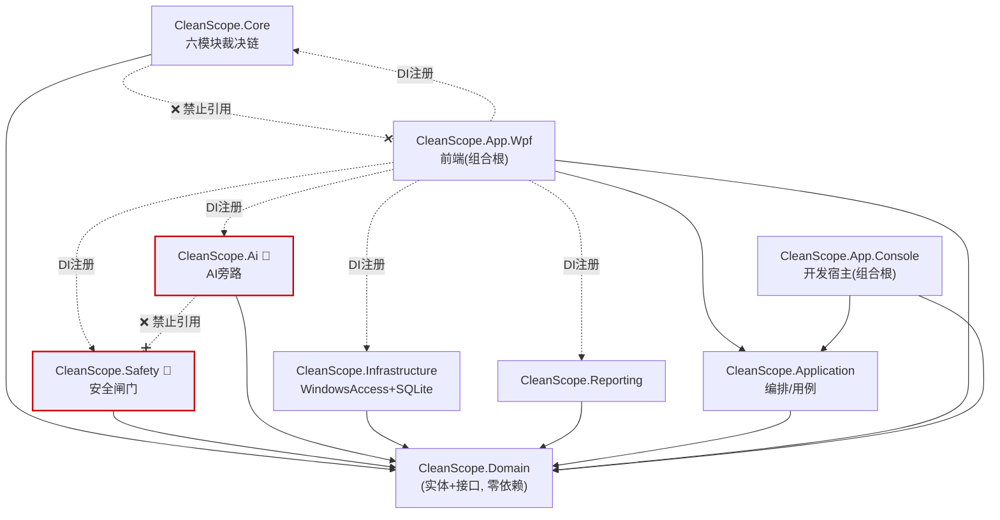

# CleanScope 模块划分（落地 .NET 项目）（MOD v1.0）

> 上游依据：[架构设计.md](架构设计.md)（六模块裁决链 + AI 旁路 + 单一安全闸门 + 四外围解耦）、[技术选型决策.md](技术选型决策.md)（C#/.NET8 预留10/WPF/SQLite，核心不依赖 WPF，AI 不入裁决链）、[数据模型设计.md](数据模型设计.md)、[知识库-目录规则.md](知识库-目录规则.md)。
> 本文件**不重复"从零反推模块"**（架构阶段已完成），而是把已冻结的抽象模块**映射到具体 .NET 项目**，确定依赖方向、开发顺序、可 mock 项与版本范围。
> 阶段：⑥ 模块拆分　｜　状态：设计稿，待评审　｜　不含实现代码。

---

## 0. 对既有结构的两点细化（非推翻）

技术选型 §4 给的目录是"第一版结构"指引（非 10 条冻结决议之一）。本阶段做两处细化，均与架构 §1 分层一致、不触碰任何冻结决议：

| 细化 | 理由 |
|---|---|
| 新增 `CleanScope.Application`（编排/用例层） | 架构 §1 本就有"②应用编排层 Orchestrator"；独立出来让 App.Wpf 保持纯 UI、Core 保持纯领域逻辑 |
| 新增 `CleanScope.App.Console`（开发自测宿主） | 在 WPF 之前先跑通"扫描→规则→风险→报告"裁决链，最小闭环可验证；非交付件，仅开发期使用 |

---

## 1. 抽象模块 → .NET 项目映射

| 架构抽象层/模块 | .NET 项目 | 性质 |
|---|---|---|
| 领域对象 + 接口契约（架构§5） | **CleanScope.Domain** | 最内核，零依赖 |
| ③核心领域层：扫描/证据/规则/归因/风险/决策 | **CleanScope.Core** | 六模块裁决链 |
| ⑤安全闸门：SafetyGuard + ActionExecutor | **CleanScope.Safety** | 🔴 唯一可改盘路径 |
| ④AI 旁路：脱敏网关 + 解释服务 + 校验器 | **CleanScope.Ai** | 🔵 仅建议，不入裁决链 |
| ⑥基础设施：WindowsAccess + SQLite + 规则加载 | **CleanScope.Infrastructure** | 外围实现 |
| 报告生成器 | **CleanScope.Reporting** | 外围实现 |
| ②应用编排层 Orchestrator | **CleanScope.Application** | 用例编排（细化新增）|
| ①表现层 GUI | **CleanScope.App.Wpf** | 前端，可替换 |
| —（开发自测宿主） | **CleanScope.App.Console** | 开发期最小闭环宿主 |

---

## 2. 各项目职责与边界

> 🔴=安全关键（须谨慎设计，不可让 AI 随意生成）；🔵=AI 旁路；🟢=可较自由实现。

### CleanScope.Domain 🟢（最内核）
- **包含**：实体 record（ScanTask/FileNode/Evidence/RiskAssessment…，见数据模型§5）、枚举（RiskLevel/NodeType…）、值对象、**全部接口契约**（`IStorage`、各 `IXxxRepository`、`IScanEngine`、`IRuleEngine`、`IRiskEngine`、`IAttributionEngine`、`IEvidenceCollector`、`IDecisionService`、`ISanitizationGateway`、`IExplanationService`、`IAiOutputValidator`、`ISafetyGuard`、`IActionExecutor`、`IReportExporter`、`IRuleSource`、`IWindowsAccess`）、安全常量（风险等级、红线枚举）。
- **依赖**：无（不引用任何其他项目，含 WPF——决议9落点）。
- **被依赖**：所有项目。
- **MVP**：必做（第一个建）。

### CleanScope.Core 🔴(规则/风险)🟢(其余)
- **包含**：六模块实现——`ScanEngine`、`EvidenceCollector`、`RuleEngine`(权威)、`AttributionEngine`、`RiskEngine`(权威)、`DecisionService`。
- **职责**：执行裁决链；规则/风险输出 `authoritative` 结果。
- **不负责**：UI、删除、AI 调用、持久化细节（经 Domain 接口）。
- **依赖**：Domain。**不依赖** Infrastructure（经接口反转）、不依赖 WPF。
- **MVP**：必做。RuleEngine/RiskEngine 为安全关键。

### CleanScope.Safety 🔴（安全闸门）
- **包含**：`SafetyGuard`（准入 10 条件、双确认状态机、黑名单拦截）、`ActionExecutor`（MVP 仅辅助操作）、审计写入协调。
- **职责**：唯一可改盘入口；MVP 对一切删除返回 Rejected。
- **依赖**：Domain。
- **关键约束**：**不被 CleanScope.Ai 引用**（决议10落点，由架构测试断言）。
- **MVP**：必做（MVP 即"全拒"形态 + 辅助操作）。

### CleanScope.Ai 🔵（旁路）
- **包含**：`SanitizationGateway`(出云唯一通道)、`ExplanationService`(本地/云端，支持降级)、`AiOutputValidator`(AS-1~8 校验)。
- **职责**：把脱敏证据转解释；输出经校验才可用。
- **依赖**：Domain。**不引用 CleanScope.Safety**（编译期隔离，结构上发不起删除）。
- **MVP**：必做（含降级：AI 不可用时回退规则解释）。

### CleanScope.Infrastructure 🔴(WindowsAccess)🟢(存储)
- **包含**：`WindowsAccess`(注册表/进程/数字签名/Appx/WinGet/文件系统访问)、`SqliteStorage` 实现 `IStorage`、各仓储实现(手写 SQL)、DDL 迁移、`RulePackLoader` 实现 `IRuleSource`(读 rules/*.json)。
- **依赖**：Domain + Microsoft.Data.Sqlite。
- **MVP**：必做。
- **注意**：WindowsAccess 的删除相关能力**不在此**（删除只在 Safety），此处仅只读取证。

### CleanScope.Reporting 🟢
- **包含**：`MarkdownReportExporter`(MVP)，后续 HTML/JSON/CSV。
- **依赖**：Domain。
- **MVP**：必做(仅 Markdown)。

### CleanScope.Application 🟢
- **包含**：用例编排器（`ScanAndAnalyzeUseCase`、`ExplainFileUseCase`、`ProcessDecisionUseCase`），协调 Core+Ai+Safety+持久化（全经接口）。
- **依赖**：Domain（编排经接口，运行时由 DI 注入实现）。
- **MVP**：必做。

### CleanScope.App.Wpf 🟢（前端）
- **包含**：视图、ViewModel(MVVM)、DI 组合根(在此把 Infrastructure/Core/Safety/Ai/Reporting 实现注入接口)。
- **依赖**：Domain + Application（仅接口）；组合根额外引用各实现项目以注册 DI。
- **MVP**：必做(在 Console 闭环跑通后)。

### CleanScope.App.Console 🟢（开发宿主，非交付）
- **包含**：命令行宿主，跑"扫描→规则→风险→决策→Markdown报告"裁决链。
- **用途**：WPF 前最小闭环验证；持续作为集成测试入口。
- **MVP**：开发期必做（最先有可运行产物）。

---

## 3. 依赖关系图（强制单向）



**铁律（架构测试断言）：**
- `Ai` ❌→ `Safety`（决议10：AI 发不起删除）。
- `Domain`/`Core` ❌→ 任何 UI 程序集（决议9：核心不依赖 WPF）。
- 任何项目 ❌→ `App.Wpf`/`App.Console`（宿主只在顶层）。
- 业务/领域项目 ❌→ Microsoft.Data.Sqlite（只 Infrastructure 引用）。

---

## 4. 推荐开发顺序（5 阶段，每阶段产出可运行物）

```text
Phase 0  脚手架      → 解决方案 + Directory.Build.props + .gitignore + Domain骨架 + 架构测试
Phase 1  最小闭环 ★  → Infrastructure存储 + ScanEngine + RuleEngine + RiskEngine + DecisionService + Markdown + Console宿主
                       (此时已能: 扫描C盘→规则命中→风险分级→出报告, 无AI无UI, 纯解释裁决链跑通)
Phase 2  归因增强    → EvidenceCollector(元数据/签名/已安装/注册表/进程) + AttributionEngine
Phase 3  AI旁路      → SanitizationGateway + ExplanationService + Validator + 降级
Phase 4  安全闸门    → SafetyGuard(MVP全拒) + ActionExecutor(辅助操作) + 审计 + 安全测试T01-20
Phase 5  前端        → App.Wpf (五页面 + MVVM + DI组合根)
```

★ **Phase 1 是第一个"魔法时刻"可演示物**：哪怕没有 AI 和界面，Console 已能输出"C 盘 Top 大目录 + 风险分级 + 静态解释"的 Markdown 报告，验证核心假设。

---

## 5. 哪些可先用 Mock / 桩

| 模块 | 早期可 mock | 说明 |
|---|---|---|
| `IExplanationService`(AI) | ✅ | Phase 1–2 用"静态模板解释"桩，Phase 3 再接真模型；天然满足"AI 可降级" |
| `IWindowsAccess` 部分(签名/Appx/WinGet) | ✅ | Phase 1 先只用文件系统遍历，元数据采集 Phase 2 补 |
| `IStorage` | ⛔ 不建议 mock 过久 | 早期可用内存实现跑通，但 SQLite 实现 Phase 1 就该到位 |
| `ISafetyGuard` | ⚠️ | Phase 1–3 无删除需求，可先用"恒拒绝"实现(恰是 MVP 正式形态) |

> 巧合优势：**MVP 的 SafetyGuard 正式形态就是"恒拒绝"**，所以前几个 Phase 的"桩"无需替换即为成品。

---

## 6. 各版本项目范围

| 项目 | MVP | Beta | v1.0 |
|---|---|---|---|
| Domain / Core / Infrastructure / Reporting / Application | ✅ | ✅ | ✅ |
| Ai（含降级） | ✅ | ✅ | ✅ |
| Safety | ✅(全拒+辅助操作) | ✅(A级删除+回收站) | ✅(+备份/还原点) |
| App.Console | ✅(开发) | 保留 | 保留 |
| App.Wpf | ✅ | ✅(完整五页) | ✅(现代化) |
| tests(Core/Safety/Ai/Architecture) | ✅ | ✅ | ✅ |

---

## 7. 评审关注点

1. 新增 `CleanScope.Application`(编排层) 与 `CleanScope.App.Console`(开发宿主) 是否认可？
2. 开发顺序"先 Console 闭环、后 WPF"是否认可（更快拿到可演示裁决链）？
3. "MVP 的 SafetyGuard = 恒拒绝即成品"这一取巧是否接受？
4. 架构测试(NetArchTest)断言决议9/10，是否 Phase 0 就纳入 CI？

> 评审通过后，见 [开发任务表.md](开发任务表.md)，按任务编号进入编码。
