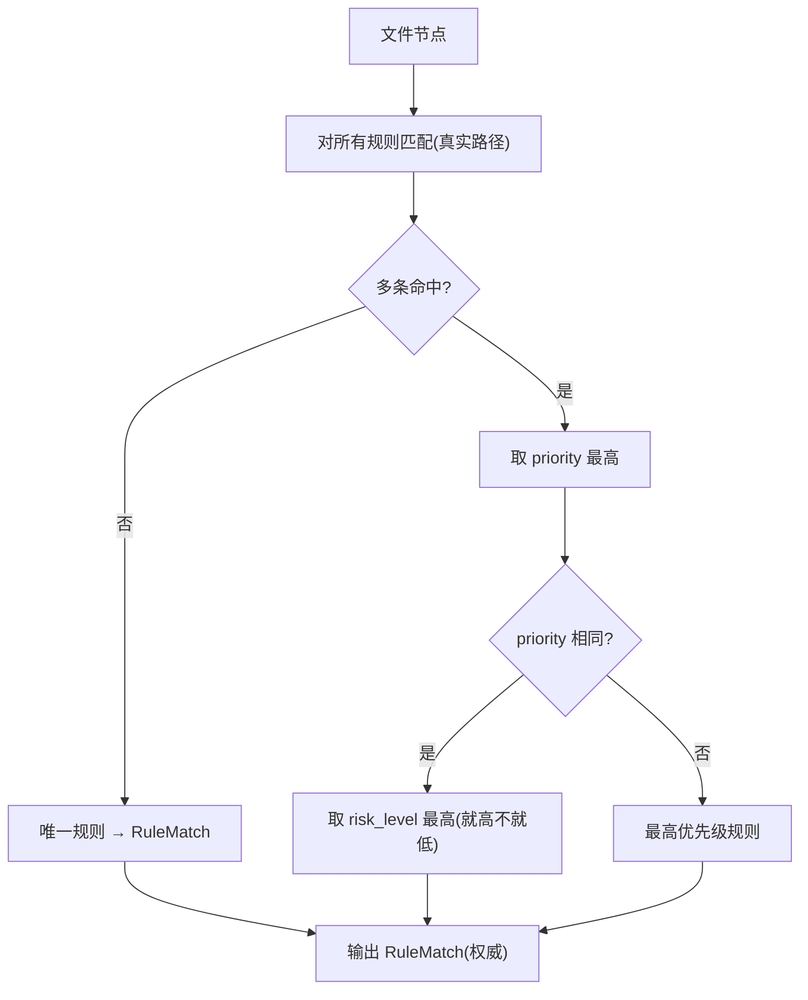

# CleanScope 知识库 · 目录规则（KB v1.0）

> 上游依据：[架构设计.md](架构设计.md)（§7 声明式规则包 schema）、[安全设计.md](安全设计.md)（§2 黑名单 / §3 禁删类型）、[风险分级细则.md](风险分级细则.md)（A–E 裁定 + 默认 C）、[数据模型设计.md](数据模型设计.md)（rule_match 字段）。
> 用途：第一版知识库，**直接对应 `rules/*.json` 规则包**。RuleEngine 加载本目录规则，输出 `RuleMatch`（权威），AI 不可翻案。
> 阶段：⑤ 知识库清单　｜　状态：设计稿，待评审　｜　覆盖 27 类（≥20 要求达成）。

---

## 0. 规则字段 schema（每条规则）

```jsonc
{
  "id": "win-installer-cache",     // 唯一标识(kebab-case)
  "pattern": "%SystemRoot%\\Installer",  // 匹配模式(环境变量按系统展开)
  "match_type": "path_prefix",     // path_prefix | path_glob | dir_name | extension
  "category": "Windows Installer Cache",
  "risk_level": "D",               // A|B|C|D|E (风险分级细则裁定)
  "direct_delete": false,          // 是否允许直删
  "is_system_critical": true,      // 是否系统关键(黑名单)
  "description": "……",             // 这是什么
  "recommended_action": "……",      // 推荐安全处理方式(优先非删除)
  "evidence_type": "path_rule",    // path_rule|dir_name_pattern|extension|metadata
  "confidence": 0.95,
  "priority": 100                  // 冲突时就高; 系统关键=100, 缓存类 50-70, 用户自定义最低
}
```

**约定：**
- `%SystemRoot%`=`C:\Windows`，`%ProgramData%`、`%ProgramFiles%`、`%UserProfile%`、`%LocalAppData%`(`AppData\Local`)、`%AppData%`(`AppData\Roaming`)、`%TEMP%` 均按实际系统展开（**不假定 C 盘**）。
- 匹配在**真实路径解析后**进行（防 symlink 绕过，IR-4）。
- 优先级冲突时**就高不就低**（安全优先，风险细则 §2）。
- 凡 `is_system_critical=true` → `risk_level=D`、`direct_delete=false`、`priority=100`，AI 不可覆盖。

---

## 1. 全量分类总览（27 类）

| # | 类别 | 风险 | 直删 | 系统关键 | 推荐处理 | 规则包文件 |
|---|---|---|---|---|---|---|
| 1 | Windows 系统核心目录 | D | ✗ | ✓ | 禁止；勿动 | 00-system-critical |
| 2 | Windows Installer 缓存 | D | ✗ | ✓ | 官方修复/卸载 | 00-system-critical |
| 3 | WinSxS 组件存储 | D | ✗ | ✓ | 仅 DISM 清理 | 00-system-critical |
| 4 | 驱动 / DriverStore | D | ✗ | ✓ | 禁止 | 00-system-critical |
| 5 | 注册表 hive / 启动文件 | D | ✗ | ✓ | 禁止 | 00-system-critical |
| 6 | 系统内存文件(pagefile等) | D | ✗ | ✓ | 系统设置调整 | 00-system-critical |
| 7 | ProgramData Package Cache | D | ✗ | ✓ | 官方安装器管理 | 10-installer |
| 8 | Windows 更新缓存(SoftwareDistribution) | C | ✗ | ✗ | DISM/磁盘清理 | 10-installer |
| 9 | Windows.old | B | ✗ | ✗ | 磁盘清理向导 | 10-installer |
| 10 | 浏览器缓存(Chrome/Edge/Firefox) | B | ✗ | ✗ | 浏览器内清理 | 20-browsers |
| 11 | Visual Studio 缓存 | C | ✗ | ✗ | VS Installer | 30-dev-ide |
| 12 | JetBrains 缓存/system | B | ✗ | ✗ | IDE 内清理/可重建 | 30-dev-ide |
| 13 | VS Code 缓存 | B | ✗ | ✗ | 可重建 | 30-dev-ide |
| 14 | npm/pnpm/yarn 缓存 | B | ✗ | ✗ | 对应 cache clean | 31-dev-pkg |
| 15 | pip/conda/uv 缓存 | B | ✗ | ✗ | 对应 cache purge | 31-dev-pkg |
| 16 | Maven/Gradle 缓存 | B | ✗ | ✗ | 清理/迁移仓库 | 31-dev-pkg |
| 17 | NuGet 缓存 | B | ✗ | ✗ | nuget locals clear | 31-dev-pkg |
| 18 | Docker 数据/镜像 | C | ✗ | ✗ | docker system prune | 32-dev-container |
| 19 | WSL 虚拟磁盘(.vhdx) | D | ✗ | ✗ | 官方迁移/compact | 32-dev-container |
| 20 | Steam/Epic 游戏与缓存 | C | ✗ | ✗ | 平台内卸载/移动 | 40-games |
| 21 | 临时文件(Temp/.tmp) | A | △ | ✗ | 可清理(仍确认) | 50-temp-log-dump |
| 22 | 缩略图缓存(thumbcache) | A | △ | ✗ | 可重建 | 50-temp-log-dump |
| 23 | 日志文件(.log/Logs) | B | ✗ | ✗ | 多数可清，避开系统活动日志 | 50-temp-log-dump |
| 24 | 崩溃转储(.dmp/MEMORY.DMP) | B | ✗ | ✗ | 排障后可清 | 50-temp-log-dump |
| 25 | 下载目录与安装包/压缩包 | B | ✗ | ✗ | 确认后可清，可重下 | 60-downloads |
| 26 | 虚拟机镜像(.vhd/.vmdk/.iso) | C | ✗ | ✗ | 确认未使用再处理 | 70-vm-images |
| 27 | 云盘同步目录(OneDrive等) | C | ✗ | ✗ | 经客户端管理，勿直删 | 90-cloud-sync |

> 用户个人数据目录（Documents/Desktop/Pictures…）不在"目录规则"内单列，由 RiskEngine 决策树的"用户个人数据→C"分支处理（风险细则 §3）；但下载目录(#25)因可重新获取单列为 B。

---

## 2. 规则包内容（可直接转 rules/*.json）

### 2.1 `rules/00-system-critical.json` —— 系统关键黑名单（最高优先级 D）

```jsonc
[
  { "id":"win-system-root", "pattern":"%SystemRoot%", "match_type":"path_prefix",
    "category":"Windows 系统目录", "risk_level":"D", "direct_delete":false, "is_system_critical":true,
    "description":"Windows 操作系统本体目录", "recommended_action":"严禁删除/修改",
    "evidence_type":"path_rule", "confidence":0.99, "priority":100 },

  { "id":"win-system32", "pattern":"%SystemRoot%\\System32", "match_type":"path_prefix",
    "category":"Windows 核心组件", "risk_level":"D", "direct_delete":false, "is_system_critical":true,
    "description":"核心系统 DLL/可执行/服务", "recommended_action":"严禁删除",
    "evidence_type":"path_rule", "confidence":0.99, "priority":100 },

  { "id":"win-syswow64", "pattern":"%SystemRoot%\\SysWOW64", "match_type":"path_prefix",
    "category":"Windows 核心组件(32位)", "risk_level":"D", "direct_delete":false, "is_system_critical":true,
    "description":"32 位系统组件", "recommended_action":"严禁删除",
    "evidence_type":"path_rule", "confidence":0.99, "priority":100 },

  { "id":"win-winsxs", "pattern":"%SystemRoot%\\WinSxS", "match_type":"path_prefix",
    "category":"WinSxS 组件存储", "risk_level":"D", "direct_delete":false, "is_system_critical":true,
    "description":"组件并存存储；删除会破坏系统且不可逆",
    "recommended_action":"仅用 DISM /StartComponentCleanup，禁止手动删除",
    "evidence_type":"path_rule", "confidence":0.98, "priority":100 },

  { "id":"win-installer-cache", "pattern":"%SystemRoot%\\Installer", "match_type":"path_prefix",
    "category":"Windows Installer Cache", "risk_level":"D", "direct_delete":false, "is_system_critical":true,
    "description":"MSI 安装/修复/更新/卸载缓存；删后软件无法修复或卸载",
    "recommended_action":"不要手动删除；通过软件官方卸载/修复处理",
    "evidence_type":"path_rule", "confidence":0.97, "priority":100 },

  { "id":"win-driverstore", "pattern":"%SystemRoot%\\System32\\DriverStore", "match_type":"path_prefix",
    "category":"驱动存储", "risk_level":"D", "direct_delete":false, "is_system_critical":true,
    "description":"驱动程序存储", "recommended_action":"严禁删除；用设备管理器/pnputil 管理",
    "evidence_type":"path_rule", "confidence":0.97, "priority":100 },

  { "id":"win-drivers", "pattern":"%SystemRoot%\\System32\\drivers", "match_type":"path_prefix",
    "category":"驱动目录", "risk_level":"D", "direct_delete":false, "is_system_critical":true,
    "description":"系统驱动 (.sys)", "recommended_action":"严禁删除",
    "evidence_type":"path_rule", "confidence":0.97, "priority":100 },

  { "id":"win-reg-hive", "pattern":"%SystemRoot%\\System32\\config", "match_type":"path_prefix",
    "category":"注册表数据库", "risk_level":"D", "direct_delete":false, "is_system_critical":true,
    "description":"SYSTEM/SOFTWARE/SAM/SECURITY 注册表 hive", "recommended_action":"严禁删除",
    "evidence_type":"path_rule", "confidence":0.99, "priority":100 },

  { "id":"win-boot", "pattern":"%SystemRoot%\\Boot", "match_type":"path_prefix",
    "category":"启动文件", "risk_level":"D", "direct_delete":false, "is_system_critical":true,
    "description":"系统启动相关；删后无法开机", "recommended_action":"严禁删除",
    "evidence_type":"path_rule", "confidence":0.98, "priority":100 },

  { "id":"win-fonts", "pattern":"%SystemRoot%\\Fonts", "match_type":"path_prefix",
    "category":"系统字体", "risk_level":"D", "direct_delete":false, "is_system_critical":true,
    "description":"系统字体目录", "recommended_action":"勿删；经字体设置管理",
    "evidence_type":"path_rule", "confidence":0.9, "priority":100 },

  { "id":"sys-pagefile", "pattern":"pagefile.sys", "match_type":"dir_name",
    "category":"系统内存文件", "risk_level":"D", "direct_delete":false, "is_system_critical":true,
    "description":"虚拟内存页面文件", "recommended_action":"经 系统>高级>虚拟内存 调整，勿直删",
    "evidence_type":"dir_name_pattern", "confidence":0.95, "priority":100 },

  { "id":"sys-hiberfil", "pattern":"hiberfil.sys", "match_type":"dir_name",
    "category":"系统内存文件", "risk_level":"D", "direct_delete":false, "is_system_critical":true,
    "description":"休眠文件", "recommended_action":"用 powercfg /hibernate off 关闭，勿直删",
    "evidence_type":"dir_name_pattern", "confidence":0.95, "priority":100 },

  { "id":"sys-swapfile", "pattern":"swapfile.sys", "match_type":"dir_name",
    "category":"系统内存文件", "risk_level":"D", "direct_delete":false, "is_system_critical":true,
    "description":"交换文件(UWP)", "recommended_action":"由系统管理，勿直删",
    "evidence_type":"dir_name_pattern", "confidence":0.9, "priority":100 },

  { "id":"sys-volinfo", "pattern":"System Volume Information", "match_type":"dir_name",
    "category":"卷影/还原点", "risk_level":"D", "direct_delete":false, "is_system_critical":true,
    "description":"还原点/卷影存储", "recommended_action":"经 系统保护 设置管理",
    "evidence_type":"dir_name_pattern", "confidence":0.9, "priority":100 },

  { "id":"sys-recyclebin", "pattern":"$Recycle.Bin", "match_type":"dir_name",
    "category":"回收站本体", "risk_level":"D", "direct_delete":false, "is_system_critical":true,
    "description":"回收站系统目录", "recommended_action":"用 清空回收站，勿直删目录",
    "evidence_type":"dir_name_pattern", "confidence":0.9, "priority":100 },

  { "id":"win-recovery", "pattern":"Recovery", "match_type":"dir_name",
    "category":"恢复环境", "risk_level":"D", "direct_delete":false, "is_system_critical":true,
    "description":"WinRE 恢复环境", "recommended_action":"严禁删除",
    "evidence_type":"dir_name_pattern", "confidence":0.85, "priority":100 }
]
```

### 2.2 `rules/10-installer.json` —— 安装/更新缓存

```jsonc
[
  { "id":"programdata-package-cache", "pattern":"%ProgramData%\\Package Cache", "match_type":"path_prefix",
    "category":"Package Cache", "risk_level":"D", "direct_delete":false, "is_system_critical":true,
    "description":"安装包缓存(VS 等)，GUID 子目录；删后修复/卸载异常",
    "recommended_action":"用对应官方安装器(如 VS Installer)管理，勿直删",
    "evidence_type":"path_rule", "confidence":0.95, "priority":100 },

  { "id":"win-update-cache", "pattern":"%SystemRoot%\\SoftwareDistribution\\Download", "match_type":"path_prefix",
    "category":"Windows 更新缓存", "risk_level":"C", "direct_delete":false, "is_system_critical":false,
    "description":"Windows Update 下载缓存", "recommended_action":"经磁盘清理或停 wuauserv 后清理，非直删",
    "evidence_type":"path_rule", "confidence":0.85, "priority":80 },

  { "id":"windows-old", "pattern":"%SystemDrive%\\Windows.old", "match_type":"path_prefix",
    "category":"旧系统备份", "risk_level":"B", "direct_delete":false, "is_system_critical":false,
    "description":"升级后旧系统备份，占用大", "recommended_action":"用 磁盘清理>以前的Windows安装 删除",
    "evidence_type":"path_rule", "confidence":0.9, "priority":70 },

  { "id":"win-temp-installer", "pattern":"%SystemDrive%\\Config.Msi", "match_type":"path_prefix",
    "category":"安装临时目录", "risk_level":"C", "direct_delete":false, "is_system_critical":false,
    "description":"MSI 安装过程临时目录", "recommended_action":"安装结束后通常自动清理，勿在安装中删",
    "evidence_type":"path_rule", "confidence":0.8, "priority":75 }
]
```

### 2.3 `rules/20-browsers.json` —— 浏览器缓存（B，走浏览器内清理）

```jsonc
[
  { "id":"chrome-cache", "pattern":"%LocalAppData%\\Google\\Chrome\\User Data\\*\\Cache", "match_type":"path_glob",
    "category":"Chrome 缓存", "risk_level":"B", "direct_delete":false, "is_system_critical":false,
    "description":"Chrome 浏览缓存，可再生成", "recommended_action":"用 Chrome 设置>清除浏览数据",
    "evidence_type":"path_rule", "confidence":0.9, "priority":60 },

  { "id":"edge-cache", "pattern":"%LocalAppData%\\Microsoft\\Edge\\User Data\\*\\Cache", "match_type":"path_glob",
    "category":"Edge 缓存", "risk_level":"B", "direct_delete":false, "is_system_critical":false,
    "description":"Edge 浏览缓存", "recommended_action":"用 Edge 设置清除浏览数据",
    "evidence_type":"path_rule", "confidence":0.9, "priority":60 },

  { "id":"firefox-cache", "pattern":"%LocalAppData%\\Mozilla\\Firefox\\Profiles\\*\\cache2", "match_type":"path_glob",
    "category":"Firefox 缓存", "risk_level":"B", "direct_delete":false, "is_system_critical":false,
    "description":"Firefox 浏览缓存", "recommended_action":"用 Firefox 设置清除缓存",
    "evidence_type":"path_rule", "confidence":0.9, "priority":60 }
]
```

### 2.4 `rules/30-dev-ide.json` —— IDE 缓存

```jsonc
[
  { "id":"vs-component-cache", "pattern":"%ProgramData%\\Microsoft\\VisualStudio\\Packages", "match_type":"path_prefix",
    "category":"Visual Studio 缓存", "risk_level":"C", "direct_delete":false, "is_system_critical":false,
    "description":"VS 安装/组件缓存", "recommended_action":"用 VS Installer 管理，勿直删",
    "evidence_type":"path_rule", "confidence":0.85, "priority":70 },

  { "id":"jetbrains-caches", "pattern":"%LocalAppData%\\JetBrains\\*\\caches", "match_type":"path_glob",
    "category":"JetBrains 缓存", "risk_level":"B", "direct_delete":false, "is_system_critical":false,
    "description":"JetBrains IDE 索引/缓存，可重建", "recommended_action":"IDE 内 Invalidate Caches，或可删后重建",
    "evidence_type":"path_rule", "confidence":0.85, "priority":60 },

  { "id":"vscode-cache", "pattern":"%AppData%\\Code\\Cache", "match_type":"path_prefix",
    "category":"VS Code 缓存", "risk_level":"B", "direct_delete":false, "is_system_critical":false,
    "description":"VS Code 缓存，可重建", "recommended_action":"可清理后由 VS Code 重建",
    "evidence_type":"path_rule", "confidence":0.85, "priority":60 }
]
```

### 2.5 `rules/31-dev-pkg.json` —— 包管理器缓存（B，走官方命令）

```jsonc
[
  { "id":"npm-cache", "pattern":"%LocalAppData%\\npm-cache", "match_type":"path_prefix",
    "category":"npm 缓存", "risk_level":"B", "direct_delete":false, "is_system_critical":false,
    "description":"npm 包缓存", "recommended_action":"用 npm cache clean --force",
    "evidence_type":"path_rule", "confidence":0.9, "priority":60 },

  { "id":"pnpm-store", "pattern":"%LocalAppData%\\pnpm\\store", "match_type":"path_prefix",
    "category":"pnpm 存储", "risk_level":"B", "direct_delete":false, "is_system_critical":false,
    "description":"pnpm 全局内容寻址存储", "recommended_action":"用 pnpm store prune",
    "evidence_type":"path_rule", "confidence":0.88, "priority":60 },

  { "id":"yarn-cache", "pattern":"%LocalAppData%\\Yarn\\Cache", "match_type":"path_prefix",
    "category":"Yarn 缓存", "risk_level":"B", "direct_delete":false, "is_system_critical":false,
    "description":"Yarn 包缓存", "recommended_action":"用 yarn cache clean",
    "evidence_type":"path_rule", "confidence":0.88, "priority":60 },

  { "id":"pip-cache", "pattern":"%LocalAppData%\\pip\\Cache", "match_type":"path_prefix",
    "category":"pip 缓存", "risk_level":"B", "direct_delete":false, "is_system_critical":false,
    "description":"pip 下载/构建缓存", "recommended_action":"用 pip cache purge",
    "evidence_type":"path_rule", "confidence":0.9, "priority":60 },

  { "id":"conda-pkgs", "pattern":"*\\conda\\pkgs", "match_type":"path_glob",
    "category":"conda 包缓存", "risk_level":"B", "direct_delete":false, "is_system_critical":false,
    "description":"conda 下载的包缓存", "recommended_action":"用 conda clean --all",
    "evidence_type":"path_rule", "confidence":0.82, "priority":60 },

  { "id":"uv-cache", "pattern":"%LocalAppData%\\uv\\cache", "match_type":"path_prefix",
    "category":"uv 缓存", "risk_level":"B", "direct_delete":false, "is_system_critical":false,
    "description":"uv Python 包缓存", "recommended_action":"用 uv cache clean",
    "evidence_type":"path_rule", "confidence":0.85, "priority":60 },

  { "id":"gradle-caches", "pattern":"%UserProfile%\\.gradle\\caches", "match_type":"path_prefix",
    "category":"Gradle 缓存", "risk_level":"B", "direct_delete":false, "is_system_critical":false,
    "description":"Gradle 依赖/构建缓存", "recommended_action":"可清理；或迁移 GRADLE_USER_HOME",
    "evidence_type":"path_rule", "confidence":0.9, "priority":60 },

  { "id":"maven-repo", "pattern":"%UserProfile%\\.m2\\repository", "match_type":"path_prefix",
    "category":"Maven 本地仓库", "risk_level":"B", "direct_delete":false, "is_system_critical":false,
    "description":"Maven 依赖仓库，可重新下载", "recommended_action":"可清理；或迁移本地仓库路径",
    "evidence_type":"path_rule", "confidence":0.88, "priority":60 },

  { "id":"nuget-packages", "pattern":"%UserProfile%\\.nuget\\packages", "match_type":"path_prefix",
    "category":"NuGet 全局包", "risk_level":"B", "direct_delete":false, "is_system_critical":false,
    "description":"NuGet 全局包缓存", "recommended_action":"用 dotnet nuget locals all --clear",
    "evidence_type":"path_rule", "confidence":0.88, "priority":60 }
]
```

### 2.6 `rules/32-dev-container.json` —— 容器/虚拟磁盘

```jsonc
[
  { "id":"docker-data", "pattern":"%AppData%\\Docker", "match_type":"path_prefix",
    "category":"Docker 数据", "risk_level":"C", "direct_delete":false, "is_system_critical":false,
    "description":"Docker Desktop 数据/配置", "recommended_action":"用 docker system prune，勿直删",
    "evidence_type":"path_rule", "confidence":0.8, "priority":70 },

  { "id":"docker-wsl-vhdx", "pattern":"%LocalAppData%\\Docker\\wsl", "match_type":"path_prefix",
    "category":"Docker WSL 磁盘", "risk_level":"D", "direct_delete":false, "is_system_critical":false,
    "description":"Docker 在 WSL2 的 ext4.vhdx 镜像磁盘(挂载中)",
    "recommended_action":"用 docker prune + wsl --shutdown 后 compact，勿直删",
    "evidence_type":"path_rule", "confidence":0.82, "priority":85 },

  { "id":"wsl-distro-vhdx", "pattern":"%LocalAppData%\\Packages\\*\\LocalState\\ext4.vhdx", "match_type":"path_glob",
    "category":"WSL 发行版磁盘", "risk_level":"D", "direct_delete":false, "is_system_critical":false,
    "description":"WSL 发行版虚拟磁盘；删除丢失该发行版全部数据",
    "recommended_action":"用 官方 compact/export，勿直删",
    "evidence_type":"path_rule", "confidence":0.85, "priority":85 }
]
```

### 2.7 `rules/40-games.json` —— 游戏平台

```jsonc
[
  { "id":"steam-apps", "pattern":"*\\Steam\\steamapps", "match_type":"path_glob",
    "category":"Steam 游戏", "risk_level":"C", "direct_delete":false, "is_system_critical":false,
    "description":"Steam 已安装游戏/下载文件", "recommended_action":"用 Steam 卸载或移动安装文件夹，勿直删",
    "evidence_type":"path_rule", "confidence":0.85, "priority":65 },

  { "id":"steam-downloading", "pattern":"*\\Steam\\steamapps\\downloading", "match_type":"path_glob",
    "category":"Steam 下载缓存", "risk_level":"B", "direct_delete":false, "is_system_critical":false,
    "description":"Steam 下载临时缓存", "recommended_action":"用 Steam 设置>下载>清除下载缓存",
    "evidence_type":"path_rule", "confidence":0.8, "priority":62 },

  { "id":"epic-games", "pattern":"*\\Epic Games", "match_type":"path_glob",
    "category":"Epic 游戏", "risk_level":"C", "direct_delete":false, "is_system_critical":false,
    "description":"Epic 已安装游戏", "recommended_action":"用 Epic 启动器卸载/移动，勿直删",
    "evidence_type":"path_rule", "confidence":0.8, "priority":65 }
]
```

### 2.8 `rules/50-temp-log-dump.json` —— 临时/日志/转储

```jsonc
[
  { "id":"user-temp", "pattern":"%TEMP%", "match_type":"path_prefix",
    "category":"用户临时目录", "risk_level":"A", "direct_delete":true, "is_system_critical":false,
    "description":"用户临时文件，多数可再生成", "recommended_action":"可清理(占用中文件会跳过)；仍建议确认",
    "evidence_type":"path_rule", "confidence":0.85, "priority":50 },

  { "id":"win-temp", "pattern":"%SystemRoot%\\Temp", "match_type":"path_prefix",
    "category":"系统临时目录", "risk_level":"B", "direct_delete":false, "is_system_critical":false,
    "description":"系统临时文件", "recommended_action":"经磁盘清理处理，部分需管理员",
    "evidence_type":"path_rule", "confidence":0.8, "priority":55 },

  { "id":"thumbcache", "pattern":"%LocalAppData%\\Microsoft\\Windows\\Explorer", "match_type":"path_prefix",
    "category":"缩略图缓存", "risk_level":"A", "direct_delete":true, "is_system_critical":false,
    "description":"thumbcache 缩略图缓存，可重建", "recommended_action":"可清理，资源管理器会重建",
    "evidence_type":"path_rule", "confidence":0.85, "priority":50 },

  { "id":"log-files", "pattern":"*.log", "match_type":"extension",
    "category":"日志文件", "risk_level":"B", "direct_delete":false, "is_system_critical":false,
    "description":"应用日志；多数可清", "recommended_action":"确认非系统活动日志后可清理",
    "evidence_type":"extension", "confidence":0.6, "priority":40 },

  { "id":"crash-dump", "pattern":"*.dmp", "match_type":"extension",
    "category":"崩溃转储", "risk_level":"B", "direct_delete":false, "is_system_critical":false,
    "description":"崩溃转储文件，排障后可清", "recommended_action":"无需排障时可清理",
    "evidence_type":"extension", "confidence":0.65, "priority":40 },

  { "id":"memory-dump", "pattern":"%SystemRoot%\\MEMORY.DMP", "match_type":"path_prefix",
    "category":"系统内存转储", "risk_level":"B", "direct_delete":false, "is_system_critical":false,
    "description":"蓝屏完整内存转储", "recommended_action":"经磁盘清理>系统错误内存转储 清理",
    "evidence_type":"path_rule", "confidence":0.8, "priority":55 }
]
```

### 2.9 `rules/60-downloads.json` —— 下载与压缩包

```jsonc
[
  { "id":"downloads-dir", "pattern":"%UserProfile%\\Downloads", "match_type":"path_prefix",
    "category":"下载目录", "risk_level":"B", "direct_delete":false, "is_system_critical":false,
    "description":"下载文件，多数可重新获取", "recommended_action":"逐项确认后清理；重要文件先移走",
    "evidence_type":"path_rule", "confidence":0.7, "priority":45 },

  { "id":"installer-archive", "pattern":"*.iso", "match_type":"extension",
    "category":"镜像/安装包", "risk_level":"B", "direct_delete":false, "is_system_critical":false,
    "description":"ISO 镜像，通常可重新下载", "recommended_action":"确认不再需要后清理",
    "evidence_type":"extension", "confidence":0.6, "priority":42 }
]
```

### 2.10 `rules/70-vm-images.json` —— 虚拟机镜像

```jsonc
[
  { "id":"vm-vhd", "pattern":"*.vhdx", "match_type":"extension",
    "category":"虚拟磁盘镜像", "risk_level":"C", "direct_delete":false, "is_system_critical":false,
    "description":"虚拟机/Hyper-V 磁盘；可能含重要数据或挂载中",
    "recommended_action":"确认未挂载且无需后再处理；优先经虚拟化工具",
    "evidence_type":"extension", "confidence":0.7, "priority":58 },

  { "id":"vm-vmdk", "pattern":"*.vmdk", "match_type":"extension",
    "category":"VMware 磁盘", "risk_level":"C", "direct_delete":false, "is_system_critical":false,
    "description":"VMware 虚拟磁盘", "recommended_action":"经 VMware 管理，确认未使用再处理",
    "evidence_type":"extension", "confidence":0.7, "priority":58 }
]
```

### 2.11 `rules/90-cloud-sync.json` —— 云盘同步目录

```jsonc
[
  { "id":"onedrive", "pattern":"%UserProfile%\\OneDrive", "match_type":"path_prefix",
    "category":"OneDrive 同步", "risk_level":"C", "direct_delete":false, "is_system_critical":false,
    "description":"OneDrive 同步目录；误删可能同步删除云端",
    "recommended_action":"经 OneDrive 客户端管理(如释放空间)，勿直删",
    "evidence_type":"path_rule", "confidence":0.85, "priority":68 }
]
```

---

## 3. 匹配优先级与冲突处理



| 优先级带 | 取值 | 含义 |
|---|---|---|
| 100 | 系统关键黑名单 | 最高，AI 不可翻案 |
| 80–85 | 更新缓存/WSL磁盘/Docker磁盘 | 高风险但非系统本体 |
| 60–75 | 软件缓存/IDE/包管理器/游戏/云盘 | 一般可处理类 |
| 40–58 | 临时/日志/转储/下载/扩展名规则 | 弱特征，置信度低 |
| <40（保留） | `rules/user/` 社区自定义 | 最低，**不得放宽系统关键目录**(IR-5) |

---

## 4. 设计说明与已知边界

1. **扩展名规则(.log/.dmp/.iso/.vhdx)置信度故意偏低**：仅凭扩展名不足以定论，最终等级由 RiskEngine 结合路径/占用/归因综合判定（风险细则 §2）。
2. **B 级一律不提供直删按钮**：即便 Beta，B 级也只给官方命令/设置入口（安全设计 §3）；仅 A 级在 Beta 起可删。
3. **`direct_delete=true` 仅 A 级少数**（user-temp、thumbcache），且仍受 SafetyGuard 全部前置条件约束（不等于自动删）。
4. **未命中任何规则 → 不在此产生结论**：交由 RiskEngine 决策树，证据不足则 E 级「无法判断」。
5. **路径占位符的跨语言/区域差异**：如"Program Files"在非英文系统仍是英文，但部分 known folder 名称需用 API 解析（实现阶段经 WindowsAccess 的 KnownFolders 获取，不硬编码中文名）。
6. **规则库可增不可轻减**：删除/放宽系统关键规则须走安全变更评审（IR-5）。

---

## 5. 评审关注点

1. 27 类覆盖是否满足第一版需要？有无你机器上的高频大目录未覆盖（可补充）？
2. WSL/Docker 的 `.vhdx` 定为 **D**（挂载中、误删丢全部数据），是否认可（比一般缓存更保守）？
3. Steam/Epic 游戏安装定 **C**（用户可能想保留，且重装代价大），下载缓存定 **B**，是否合适？
4. 扩展名规则置信度偏低、最终交 RiskEngine 综合判定，是否认可这种"路径强、扩展名弱"的策略？
5. 确认后设计阶段全部收口，进入 **阶段⑥ 模块拆分 → 任务表 → 编码**。

> 本知识库与 [安全设计.md](安全设计.md)、[风险分级细则.md](风险分级细则.md) 共同构成 RuleEngine 与 RiskEngine 的实现依据。规则 JSON 落地于 `rules/`，作为声明式数据随应用分发、可热更新(v1.0)。
