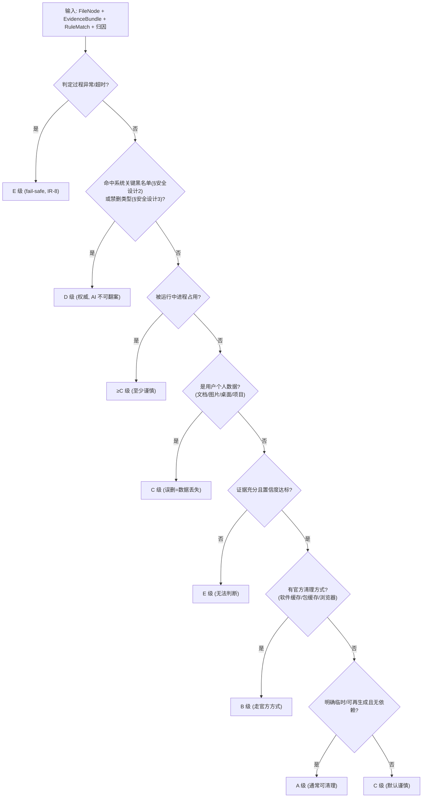

# CleanScope 风险分级细则（RISK v1.0）

> 上游依据：[需求冻结文档.md](需求冻结文档.md)（A–E 五级定义）、[安全设计.md](安全设计.md)（黑名单/禁删类型/AI 规则）、[架构设计.md](架构设计.md)（RiskEngine 权威、证据链）。
> 用途：把"五级风险"从概念变成 **RiskEngine 可执行的判定逻辑** + **规则库可标注的字段**。本文件是规则库 `risk_level` 字段与风险评分算法的唯一裁定标准。
> 阶段：④ 安全模型（配套）　｜　状态：设计稿，待评审　｜　不含实现代码。

---

## 1. 五级定义与处置（速查）

| 等级 | 名称 | 含义 | MVP 处置 | Beta+ 处置 |
|---|---|---|---|---|
| **A** | 通常可清理 | 临时文件、明确可再生成缓存 | 仅解释 + 给官方/手动清理说明 | 可删（移回收站 + 双确认） |
| **B** | 走官方方式清理 | 软件/包/浏览器缓存 | 解释 + 推荐官方命令/设置 | 推荐官方方式；不提供直删按钮 |
| **C** | 谨慎处理 | 应用数据、旧版本、日志、备份、用户文档 | 解释 + 建议先备份/确认 | 不直删；强提示备份 |
| **D** | 高风险 | 系统组件、安装器缓存、驱动、核心依赖 | 解释为何不能删 + 官方替代 | **禁删**（隐藏删除入口） |
| **E** | 无法判断 | 证据不足/来源不明 | "无法判断，不建议删除" | **禁删**；提示进一步确认 |

> **铁律：MVP 全级别只解释、不删。** 删除能力 Beta 起仅对 A 级开放（安全设计 §4 的 C1）。

---

## 2. 判定决策树（RiskEngine 主流程）

判定**自上而下短路**：命中靠前规则即定级，不再下探。**保守优先：多重信号冲突时就高不就低。**



> **默认落点是 C（谨慎），不是 A。** 只有明确证据指向"临时/可再生成/无依赖"才降到 A——宁可保守，不可激进。

---

## 3. 各级判定规则（可直接转为规则库标注）

### A 级 · 通常可清理
**同时满足：** ①明确临时文件或可再生成缓存；②不在任何黑名单/禁删类型；③未被进程占用；④非用户个人数据；⑤证据充分（is_fact 为主）。
**典型：** `%TEMP%`、`%LocalAppData%\Temp` 下的 `.tmp`；明确的缩略图缓存；可一键重建的预览缓存。
**判据来源：** path_rule + extension + 无进程占用。

### B 级 · 走官方方式清理
**满足：** 是某软件/包管理器/浏览器的缓存，删除安全但**存在更优的官方清理路径**（命令/设置），直删可能影响该软件状态。
**典型：** 浏览器缓存（建议浏览器内清理）、`pip cache`/`.gradle/caches`/`npm-cache`/`conda pkgs`（建议对应命令）、Docker/WSL 缓存（建议官方迁移/清理）。
**处置：** 优先展示官方命令/设置入口；即便 Beta 也**不提供直删按钮**（仅 A 级有）。

### C 级 · 谨慎处理
**任一满足：** ①用户个人数据（文档/图片/桌面/视频/音乐/项目文件）；②应用数据/配置（删后软件重置或丢登录态）；③旧版本文件/日志/备份，用途不完全确定；④被进程占用；⑤云盘同步目录（误删可能同步删云端）。
**处置：** 解释 + 强烈建议先备份或确认用途；Beta 起也不直删，只提示。

### D 级 · 高风险（权威，AI 不可翻案）
**任一满足：** ①命中系统关键黑名单（安全设计 §2）；②命中禁删类型（安全设计 §3：驱动/注册表 hive/启动文件/系统内存文件/安装器缓存/系统签名二进制）；③应用核心依赖/运行时（删后软件无法启动/修复/卸载）。
**处置：** 明确"不建议删除"+ 解释后果 + 官方替代方案；UI **隐藏删除入口**。

### E 级 · 无法判断
**任一满足：** ①证据不足（无规则命中、元数据缺失、归因置信度低）；②来源不明的随机命名目录且无任何匹配；③AI 与引擎冲突被降级；④判定过程异常（fail-safe）。
**处置：** 输出"无法判断，不建议删除"；提示用户进一步确认（如查看占用、搜索目录名）；**绝不给删除建议**。

---

## 4. 风险评分（0–100，与等级映射）

评分用于**同级内排序**和辅助展示，但**最终等级以 §3 决策树为准**（评分不得把 D/E 拉低成可删）。

### 4.1 区间映射

```text
0–20   → A   通常可清理
21–40  → B   走官方方式
41–60  → C   谨慎处理
61–80  → D   高风险
81–100 → E/D 不建议删除或无法判断
```

### 4.2 评分因素（加分=更不建议删）

| 因素 | 方向 | 说明 |
|---|---|---|
| 位于系统关键目录 | ++++ | 直接拉满至 D |
| 命中禁删类型 | ++++ | 拉满至 D |
| 被进程占用 | +++ | 至少 C |
| 是用户个人数据 | +++ | 至少 C |
| 有明确软件归属且为依赖 | ++ | 偏 C/D |
| 证据不足/归因低置信 | ++ | 推向 E |
| 云盘同步目录 | ++ | 偏 C |
| 有官方清理方式 | →B | 导向 B（非简单加减分） |
| 位于用户临时目录 | −− | 偏 A |
| 明确可再生成、无依赖 | −−− | 偏 A |

### 4.3 评分护栏（硬约束）
- 命中黑名单/禁删类型 → 分数**强制 ≥61（D）**，任何减分因素无效。
- 证据不足 → 不得评为 A/B，至少推向 E。
- **评分只能在 §3 决策树定下的等级"区间内"微调排序，不能跨级降低危险性。**

---

## 5. 置信度门槛

| 置信度 | 处理 |
|---|---|
| 高（≥0.8，事实证据为主） | 正常按 §3 定级 |
| 中（0.5–0.8） | 可定级，但解释中标注"中等置信，建议确认" |
| 低（<0.5，或以 AI 推测为主） | **不得评为 A/B**；倾向 C 或 E；删除建议一律收紧 |

> 置信度与 `Evidence.is_fact` 联动：事实证据多→置信度高；以 AI 推测为主→置信度低→保守。

---

## 6. 典型样例对照（验证判定一致性）

| 路径/对象 | 命中信号 | 等级 | 处置 |
|---|---|---|---|
| `C:\Windows\Installer\{GUID}.msi` | 黑名单+安装器缓存 | **D** | 禁删，导向官方 |
| `C:\Windows\System32\drivers\xxx.sys` | 黑名单+驱动 | **D** | 禁删 |
| `C:\ProgramData\Package Cache\{GUID}` | Package Cache | **D** | 禁删，VS Installer 处理 |
| `%TEMP%\xxx.tmp` | 临时目录+.tmp+无占用 | **A** | 可清理（Beta 起，仍确认） |
| `%LocalAppData%\Google\Chrome\...\Cache` | 浏览器缓存 | **B** | 推荐浏览器内清理 |
| `C:\Users\me\.gradle\caches` | 包缓存+有官方命令 | **B** | 推荐 gradle 清理/迁移 |
| `C:\Users\me\Documents\paper.docx` | 用户个人数据 | **C** | 谨慎，提示备份 |
| `C:\Users\me\AppData\Roaming\SomeApp` | 应用数据 | **C** | 谨慎（丢配置/登录态） |
| `C:\Users\me\Downloads\setup_x64.exe` | 下载安装包，可再获取 | **A/B** | 可清理，提示可重新下载 |
| `C:\Users\me\AppData\Local\{随机串}` 无匹配 | 无规则命中+低置信 | **E** | 无法判断，不建议删除 |
| WSL `ext4.vhdx`（挂载中） | 虚拟磁盘+占用 | **C/D** | 禁直删，导向官方迁移 |

---

## 7. 与规则库/引擎的衔接

- 规则库每条规则的 `risk_level` 字段，取值必须符合本文件 §3 判定。
- RiskEngine 实现 = §2 决策树 + §4 评分护栏 + §5 置信度门槛；输出 `RiskAssessment{ level, score, factors, evidence_chain }`，**evidence_chain 非空**（SR-5）。
- D 级标 `is_system_critical`/`authoritative`，AI 校验器据此执行 AS-2/AS-3（安全设计 §5）。
- 任何"无法判断"统一走 E，绝不 fail-open（IR-8）。

---

## 8. 评审关注点

> **已确认（2026-06-14）：默认落点 = C 谨慎（证据不明确一律偏保守），冻结为风险引擎硬规则。**

1. ✅ **默认落点设为 C（谨慎）而非 A** —— 已确认，安全优先。
2. 用户个人数据定 C 级（而非更高 D），是否合适？（既防误删又不过度拦截正常清理）
3. 评分护栏"命中黑名单强制≥D、减分无效"是否确认为硬约束？
4. 置信度 <0.5 不得评 A/B，是否纳入硬规则？

> 评审通过后，本文件 + [安全设计.md](安全设计.md) 共同作为 **阶段⑤ 知识库清单** 与规则库标注的裁定标准。
